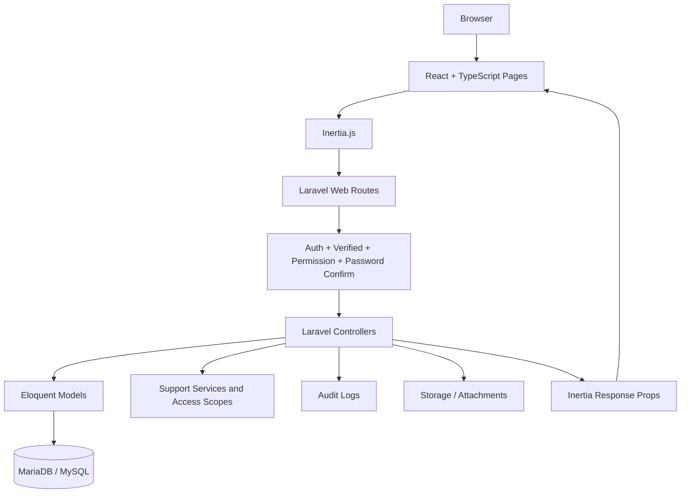
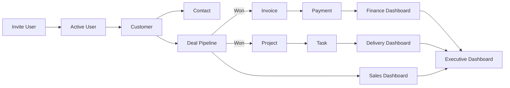
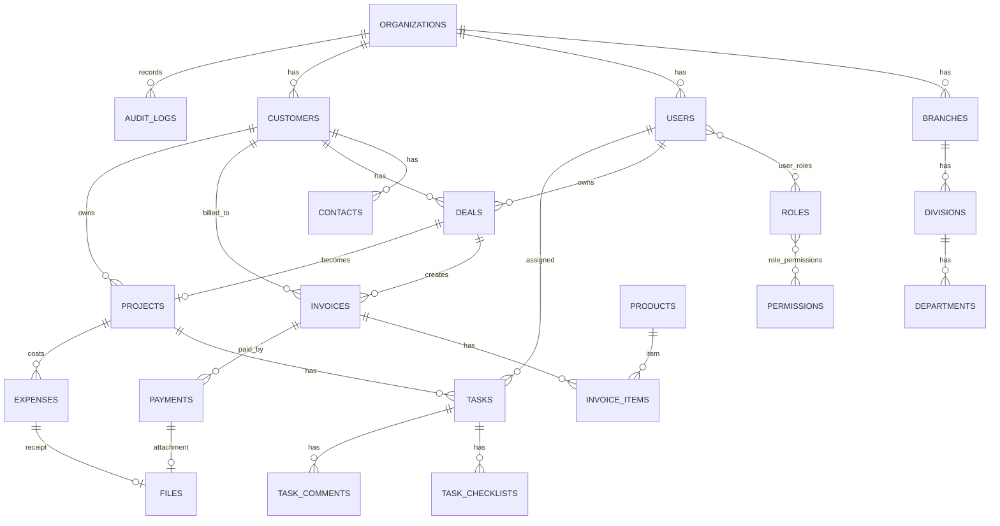
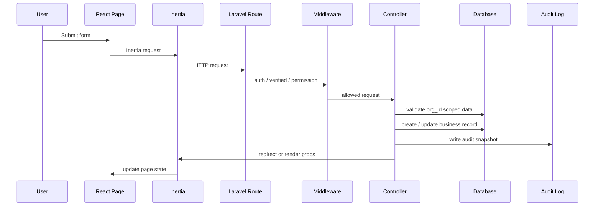

# Company OS / Lightweight ERP

ระบบ ERP ขนาดเบาสำหรับ SME, บริษัทบริการ, software agency, studio และทีมส่งมอบงานภายในองค์กร

ระบบนี้ออกแบบให้ครอบคลุม flow หลักของธุรกิจบริการ:

```text
Invite user -> Customer -> Deal -> Invoice -> Payment -> Project -> Task -> Dashboard
```

สถานะล่าสุด: **Phase 7 Closed**  
ฟีเจอร์หลักถึงตอนนี้เสร็จแล้วตั้งแต่ Auth, Admin, CRM, Finance, Delivery, Executive Dashboard, Dashboard Date Filters, Configurable Numbering, Suppliers, Purchase Orders และ Project Members

เอกสารสถานะงานหลักอยู่ที่ [`checklist.md`](checklist.md)

---

## ใช้ทำงานอะไร

โปรเจกต์นี้ใช้เป็นระบบบริหารบริษัทแบบรวมศูนย์ ตั้งแต่จัดการผู้ใช้ ลูกค้า งานขาย ใบแจ้งหนี้ การรับเงิน ค่าใช้จ่าย โครงการ งานย่อย และ dashboard ผู้บริหาร

เหมาะกับองค์กรที่ต้องการเห็นภาพเดียวกันทั้งทีม:

- ฝ่ายขายเห็นลูกค้า ดีล และ follow-up
- ฝ่ายบัญชีเห็น invoice, payment, expense และ cash flow
- ฝ่ายส่งมอบเห็น project, task, workload และ delivery risk
- ผู้บริหารเห็น pipeline, revenue, AR, profit, project status และ risk รวม
- Admin จัดการ organization, user, role, permission และ audit log

---

## Technology Stack

| Layer | Technology |
| --- | --- |
| Backend | PHP 8.3, Laravel 13 |
| Frontend | React 18, TypeScript |
| SPA Bridge | Inertia.js |
| Styling | Tailwind CSS |
| Build Tool | Vite |
| Database | MariaDB / MySQL |
| Auth | Laravel Breeze |
| Test | PHPUnit |
| Quality | Laravel Pint, ESLint, Prettier |

---

## Module Overview

| Module | หน้าที่ |
| --- | --- |
| Organization | เก็บข้อมูลบริษัท, branch, division, department |
| User & Role | จัดการผู้ใช้, invite, role, permission, disable/enable |
| Auth | สมัคร, login, logout, reset password, email verification, accept invite |
| Audit Log | บันทึก action สำคัญพร้อม before/after snapshot |
| CRM | จัดการ customer, contact, primary contact |
| Sales | จัดการ deal pipeline, won/lost, activity, follow-up |
| Product Catalog | จัดการสินค้า/บริการสำหรับออก invoice |
| Invoice | สร้าง invoice จาก deal หรือ manual invoice |
| Payment | รับชำระเงิน, partial/full payment, reversal, overpay guard |
| Expense | บันทึกค่าใช้จ่าย, approve, pay, reject, แนบ receipt |
| File Attachment | จัดเก็บไฟล์ payment/expense แบบตรวจ permission จาก parent |
| Project | สร้าง project จาก won deal หรือ manual project |
| Task | งานย่อย, checklist, comment, assignee visibility |
| Dashboard | Admin, Executive, Finance, Delivery, Sales dashboard |
| Reporting Filters | filter dashboard แบบ all-time, month, year, custom range |

---

## Module Details

### 1. Organization

ใช้เก็บโครงสร้างบริษัทแบบ tenant เดียวต่อองค์กร

- `organizations`
- `branches`
- `divisions`
- `departments`

โครงสร้าง hierarchy:

```text
Organization
└── Branch
    └── Division
        └── Department
            └── User
```

ระบบ validate chain ทุกครั้ง เช่น department ต้องอยู่ใต้ division และ branch เดียวกัน

### 2. User, Role, Permission

ระบบสิทธิ์เป็น RBAC

Default roles:

- `owner`
- `admin`
- `sales`
- `project_manager`
- `finance`
- `member`
- `viewer`

Permission ใช้รูปแบบ code เช่น:

- `customers.view`
- `deals.create`
- `invoices.update`
- `payments.reverse`
- `projects.reassign`
- `executive.dashboard.view`

ผู้ใช้มีได้หลาย role และ effective permission คือ union ของทุก role

### 3. CRM & Sales

ดูแลตั้งแต่ลูกค้าจนถึง deal

- Customer มี owner
- Contact อยู่ใต้ customer
- Primary contact มีได้ 1 คนต่อ customer
- Deal มี stage: `new`, `contacted`, `qualified`, `proposal`, `negotiation`, `won`, `lost`
- ถ้า deal เป็น `lost` ต้องมี `lost_reason`
- ถ้า deal เป็น `won` ระบบบันทึก `won_at`
- Activity ใช้ polymorphic timeline สำหรับ customer/deal

### 4. Finance

ดูแลสินค้า ใบแจ้งหนี้ การรับเงิน ค่าใช้จ่าย และรายงานการเงิน

ฟีเจอร์หลัก:

- Product/service catalog
- Manual invoice
- Invoice from deal
- Server-side invoice calculation
- Tax mode: `exclusive`, `inclusive`, `no_tax`
- Partial payment
- Full payment
- Overpay prevention ด้วย DB transaction/lock
- Payment reversal
- Expense draft/approve/pay/reject
- Attachment สำหรับ payment slip และ expense receipt

กฎสำคัญ:

- Payment ห้ามลบทิ้ง ใช้ reversal เท่านั้น
- Invoice ที่มี payment แล้ว ห้ามแก้ยอด
- Receipt download ต้องตรวจ permission ผ่าน parent entity
- `storage_key` สร้างฝั่ง server เท่านั้น

### 5. Delivery

ดูแล project และ task หลังปิดการขาย

ฟีเจอร์หลัก:

- สร้าง project จาก won deal
- 1 won deal สร้าง project ได้ 1 อัน
- Manual project
- Internal task ที่ไม่มี project ได้
- Task มี assignee, status, priority, due date
- Checklist และ comment ใต้ task
- Member เห็นเฉพาะ task ที่ assign ให้ตัวเอง
- Blocked task ไม่นับเป็น overdue

Project cost:

```text
actual_cost = sum(expenses.amount)
where expense.project_id = project.id
and expense.status in approved, paid
```

ระบบไม่เก็บ `projects.actual_cost` เพื่อกันข้อมูลไม่ sync

### 6. Dashboard

Dashboard แยกตาม scope:

- Admin Dashboard
- Executive Dashboard
- Finance Dashboard
- Delivery Dashboard
- Sales Dashboard

Dashboard filter รองรับ:

- `all_time`
- `month`
- `year`
- `custom`

Query params:

```text
period=month
month=2026-08
year=2026
from=2026-08-01
to=2026-08-31
```

---

## System Architecture



หลักการ:

- Laravel เป็น backend และ route owner
- React เป็น page UI
- Inertia ส่ง props จาก controller ไป React โดยไม่ต้องทำ public API แยก
- ทุก query ธุรกิจต้อง scope ด้วย `org_id`
- ทุก write action สำคัญต้องผ่าน permission และบางจุดต้อง re-auth

---

## Business Workflow Diagram



---

## Data Relationship Diagram



---

## Request Lifecycle



---

## Security Model

ระบบวาง baseline ความปลอดภัยไว้แบบนี้:

- Multi-tenant isolation ด้วย `org_id`
- Cross-org access ต้องได้ `404` หรือถูก block
- RBAC ผ่าน permission middleware
- Sensitive write ใช้ `password.confirm`
- Write routes หลายจุดมี `throttle:10,1`
- Password เก็บแบบ hash เท่านั้น
- ไม่ expose `password`, `remember_token`, token, secret ใน Inertia props
- `person_id` ถูก mask เว้นแต่มี permission เฉพาะ
- Payment ใช้ transaction lock กัน overpay
- Attachment download ตรวจ permission จาก parent entity
- Audit log ไม่ควรเก็บ secret หรือข้อมูล sensitive เต็ม

---

## Project Structure

```text
ERP/
├── backend/
│   ├── app/
│   │   ├── Http/
│   │   │   ├── Controllers/
│   │   │   └── Middleware/
│   │   ├── Models/
│   │   ├── Policies/
│   │   ├── Providers/
│   │   ├── Services/
│   │   └── Support/
│   ├── bootstrap/
│   ├── config/
│   ├── database/
│   │   ├── migrations/
│   │   ├── factories/
│   │   └── seeders/
│   ├── public/
│   ├── resources/
│   │   ├── css/
│   │   ├── js/
│   │   │   ├── Components/
│   │   │   ├── Layouts/
│   │   │   ├── Pages/
│   │   │   ├── Types/
│   │   │   └── Utils/
│   │   └── views/
│   ├── routes/
│   ├── storage/
│   └── tests/
├── docs/
│   ├── database/
│   └── modules/
├── checklist.md
├── ERP_FEATURE_PLAN.md
├── MVP_SCOPE.md
├── PROJECT.md
└── README.md
```

---

## Important Backend Paths

| Path | หน้าที่ |
| --- | --- |
| `backend/routes/web.php` | web routes ทั้งหมด |
| `backend/app/Http/Controllers/Admin/DashboardController.php` | Admin/Executive/Finance/Delivery dashboard |
| `backend/app/Http/Controllers/Sales/` | Customer, Contact, Deal, Activity |
| `backend/app/Http/Controllers/Finance/` | Product, Invoice, Payment, Expense |
| `backend/app/Http/Controllers/Delivery/` | Project, Task |
| `backend/app/Support/PermissionCatalog.php` | permission และ default role map |
| `backend/app/Support/SalesAccess.php` | sales visibility scope |
| `backend/app/Support/ProjectAccess.php` | project visibility scope |
| `backend/app/Support/TaskAccess.php` | task visibility scope |
| `backend/app/Services/NumberSequenceService.php` | running number generator |
| `backend/app/Services/OrganizationProvisioner.php` | create organization bootstrap |

---

## Important Frontend Paths

| Path | หน้าที่ |
| --- | --- |
| `backend/resources/js/app.tsx` | React/Inertia entrypoint |
| `backend/resources/js/Layouts/AuthenticatedLayout.tsx` | layout หลัง login |
| `backend/resources/js/Layouts/GuestLayout.tsx` | layout หน้า auth |
| `backend/resources/js/Pages/Dashboard.tsx` | dashboard หลัก |
| `backend/resources/js/Pages/Sales/` | CRM/Sales pages |
| `backend/resources/js/Pages/Finance/` | Finance pages |
| `backend/resources/js/Pages/Delivery/` | Delivery pages |
| `backend/resources/js/Pages/Admin/` | Admin pages |
| `backend/resources/js/Components/UI/` | shared UI components |
| `backend/resources/js/Types/` | TypeScript shared types |

---

## Database Conventions

- Primary key ใช้ UUID / ordered UUID
- ตารางธุรกิจหลักมี `org_id`
- ยอดเงินใช้ `DECIMAL(18,2)`
- รหัสธุรกิจเดิมใช้เลข 6 หลัก เช่น `000001`
- `created_by`, `updated_by`, `created_at`, `updated_at` ใช้กับตารางหลัก
- Soft delete ใช้กับ entity ที่ลบได้
- Financial records ไม่ลบง่าย ใช้ void/reversal/status แทน

รายละเอียด schema ดูที่ [`docs/database/DATABASE.md`](docs/database/DATABASE.md)

---

## Routes Summary

| Route | Module |
| --- | --- |
| `/dashboard` | Admin dashboard |
| `/executive-dashboard` | Executive dashboard |
| `/finance-dashboard` | Finance dashboard |
| `/delivery-dashboard` | Delivery dashboard |
| `/sales-dashboard` | Sales dashboard |
| `/customers` | CRM customers |
| `/deals` | Sales deals |
| `/products` | Product catalog |
| `/invoices` | Invoices |
| `/expenses` | Expenses |
| `/projects` | Delivery projects |
| `/tasks` | Delivery tasks |
| `/users` | User management |
| `/roles` | Role/permission management |
| `/audit-logs` | Audit log |
| `/settings/organization` | Organization settings |
| `/settings/organization-structure` | Branch/division/department |

---

## Setup

เข้า backend:

```powershell
cd backend
```

ติดตั้ง dependency:

```powershell
composer install
pnpm install
```

ตั้งค่า environment:

```powershell
copy .env.example .env
php artisan key:generate
```

สร้าง database และ seed:

```powershell
php artisan migrate:fresh --seed
```

สร้าง storage link:

```powershell
php artisan storage:link
```

---

## Run Locally

เปิด terminal 2 หน้าต่าง

Backend:

```powershell
cd backend
php artisan serve
```

Frontend:

```powershell
cd backend
pnpm run dev
```

เปิดเว็บ:

```text
http://127.0.0.1:8000
```

---

## Demo Accounts

หลัง seed แล้ว login ได้ด้วย password:

```text
password
```

| Role | Email |
| --- | --- |
| Owner | `owner@example.com` |
| Admin | `admin@example.com` |
| Sales | `sales@example.com` |
| Project Manager | `pm@example.com` |
| Finance | `finance@example.com` |
| Member | `member@example.com` |
| Viewer | `viewer@example.com` |

---

## Verification

รัน test backend:

```powershell
php artisan test
```

ตรวจ frontend:

```powershell
pnpm run lint
pnpm run check-format
pnpm run build
```

ตรวจ style PHP:

```powershell
vendor\bin\pint
```

ผลทดสอบล่าสุดที่รันในเครื่องนี้:

```text
php artisan test
170 passed, 1372 assertions
```

---

## Current Phase Status

| Phase | Status | Summary |
| --- | --- | --- |
| Phase 0 | Done | Documentation lock |
| Phase 1 | Done | Foundation, Auth, Admin Dashboard |
| Phase 1.1 | Done | Master Data, User, Role, Permission |
| Phase 2 | Done | CRM/Sales |
| Phase 3 | Done | Finance |
| Phase 4 | Done | Delivery |
| Phase 5 | Done | Executive Dashboard, E2E, UAT |
| Phase 6 | Done | Reporting filters, dashboard polish, document number expansion, invoice VAT compliance |
| Phase 7 | Closed | Configurable numbering, inclusive VAT UI, suppliers, purchase orders, project members |

---

## Deferred / Post-MVP

รายการที่ยังไม่อยู่ใน MVP:

- Generic file attachment ทุก module
- Native `.xlsx` export via PhpSpreadsheet, blocked until PHP has `ext-gd` and `ext-zip`
- Public API
- Advanced official document font hardening for print-shop production
- Advanced tax/accounting reports
- Accounting integration
- Payroll
- Inventory warehouse/bin-level costing
- Customer portal
- AI assistant

---

## Phase 8 / Production Roadmap

ข้อเสนอแนะจาก `gemini.md` สำหรับงานถัดไป:

- Official Document Print & PDF Export: Invoice, Tax Invoice/Receipt, PO
  - Done: official print views, PDF binary export, BahtText, Original/Copy, VOID watermark, logo/branch header, org-scope guards
  - Done: 50-Tawi WHT certificate PDF
  - Remaining: deeper Thai font hardening if required
- Inventory & Goods Receipt: รับสินค้าเข้าคลังจาก PO ที่ approve แล้ว
  - Done: GRN from approved PO, partial receive, over-receive guard, stock ledger, adjustment in/out, supplier return, on-hand summary, average cost
- Tax & Accounting Reports: Sales Tax, Purchase Tax, export Excel/CSV สำหรับ ภ.พ.30
  - Done: Sales/Purchase Tax report page, WHT report, CSV export, Excel-compatible `.xls` export, AR/AP Aging
  - Remaining: Expenses/GRN purchase tax source expansion once tax source schema exists
- Email Notifications & Queues: PO approval, invoice due/overdue, invite email
  - Done: PO approval, invoice due/overdue, invite email, task/project assignment, queued mail, in-app notification bell, unread count, dedupe guard, preferences

---

## Development Notes

- `checklist.md` คือ source of truth ของสถานะงาน
- `docs/database/DATABASE.md` คือ source of truth ของ schema
- ก่อนเพิ่ม module ใหม่ควรแก้ docs และ checklist ก่อน
- ห้ามรับ `org_id` จาก client สำหรับ business write
- ห้าม expose secret/token/password ใน Inertia props
- Write action สำคัญควรมี audit log
