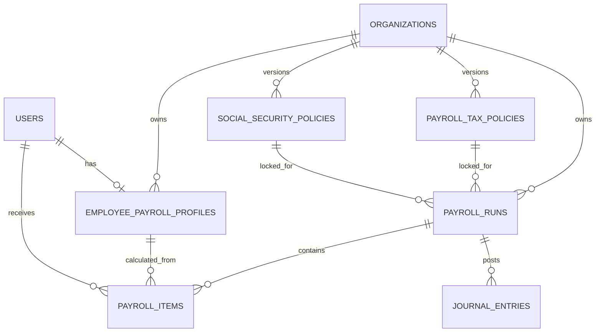

# Phase 16B: Payroll, Social Security & Tax

สถานะ: **Done** (migrations batch 8, 2026-08-30)

## ขอบเขตที่ implement

- Employee payroll profile ผูก `users` โดยตรง: เงินเดือน, allowance/deduction คงที่, tax ID, ประกันสังคม, วิธีจ่ายเงิน
- Policy ภาษีและประกันสังคมแบบ effective-dated ต่อองค์กร
- Payroll run สกุลเงิน THB เท่านั้น: `draft -> calculated -> approved -> paid`
- Payroll item เป็น immutable calculation snapshot ต่อพนักงานต่อ run
- Payslip PDF: ผู้ใช้ดูได้เฉพาะของตนเอง; ฝ่ายที่มี `payroll.view` ดูได้ตามองค์กร
- Workpaper CSV: ภ.ง.ด.1 และประกันสังคม สำหรับตรวจ/นำเข้าตามกระบวนการที่องค์กรรับรอง
- GL: approve รับรู้ salary/employer social-security expense และ liability; pay ตัด `Payroll Payable` กับ cash/bank account

## Non-goals และ compliance boundary

- ไม่มี attendance, leave, OT, employee master แยก หรือ bank-file generator ใน Phase 16B
- ไม่ใช้ `VendorPayment`; payroll payment เป็น source type `payroll_run` แยกชัดเจน
- CSV ไม่ใช่ไฟล์ e-Filing ที่รับรอง ต้องตรวจ format, อัตรา และกฎล่าสุดก่อนยื่นจริง
- policy ที่ถูกผูกกับ run แล้วไม่ถูก recalculation จาก policy ใหม่

## Data model



## Processing flow

```mermaid
sequenceDiagram
    actor Finance
    participant Profile as Payroll Profile
    participant Policy as Effective-dated Policy
    participant Run as Payroll Run
    participant GL as Journal Posting
    participant Employee

    Finance->>Run: Create draft period (THB)
    Run->>Policy: Lock policy IDs at period end
    Finance->>Run: Calculate
    Run->>Profile: Read active profiles
    Run->>Run: Create payroll_items + calculation snapshots
    Finance->>Run: Approve
    Run->>GL: Debit salary/SS expense; credit payroll/tax/SS liabilities
    Finance->>Run: Mark paid
    Run->>GL: Debit payroll payable; credit cash/bank
    Employee->>Run: Download own payslip PDF
```

## Permissions and routes

| Permission | Use |
| --- | --- |
| `payroll.view` | Payroll screen and team payslips |
| `payroll.manage` | Profiles, policies, create/calculate runs |
| `payroll.approve` | Approve and GL post |
| `payroll.pay` | Mark paid and payment GL post |
| `payroll.export` | Workpaper CSV export |

Routes are documented in [ROUTES_AND_SCREENS.md](./ROUTES_AND_SCREENS.md).
