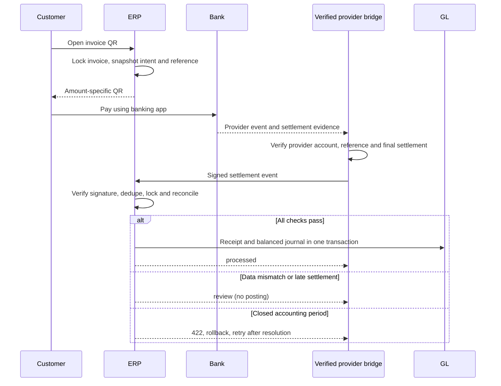

# Phase 23: PromptPay and Gateway Settlement

Status: implementation and verification in progress. Do not treat the HMAC bridge as a native Omise, GB Prime Pay or 2C2P integration.

Verification on 2026-09-09: Phase 23 has 8 passing feature tests. The combined Phase 23/Phase 3 receipts/Phase 14 FX run passed 26 tests and 147 assertions. A previous combined Phase 23/22 portal/11 GL run passed 13 tests and 117 assertions. QR portal access and invoice PDF rendering share an intent and are tested. TypeScript, scoped ESLint and Vite production build passed. SQLite migration tests passed; MySQL remains unverified because Windows denied starting the stopped `mysql8` service.

## Implemented flow

The organization configures a registered Biller ID (15 digits, tag 30) or a PromptPay Tax ID (13 digits, tag 29), a THB receiving bank and a settlement bridge signing secret. The feature defaults to disabled. Secrets and recipient identifiers are encrypted at rest and excluded from model serialization.

Only issued, unpaid THB invoices can produce an intent. `gateway_transactions` stores the invoice, organization, receiving bank, exact amount in satang, random reference, QR payload and a 30-minute expiry. Repeated rendering reuses an active intent for the same amount. Recipient/bank changes are blocked while active intents exist. The invoice print/PDF and customer portal use the same QR service. SVG QR images are generated locally with Endroid/Bacon and need no GD extension or external image service.

Tag 30 carries reference 1 and optional reference 2. Tag 29 cannot carry bill-payment references; an integration must independently bind a verified provider payment to the ERP transaction reference. Amount alone is never a matching key. Expiry is enforced by the ERP reconciliation gate; a printed static QR does not force a banking application to reject a late transfer. Late settlements go to review.

## Settlement bridge contract

`POST /api/gateway/{config-id}/settlement` is a stateless API endpoint, separate from browser CSRF and staff authentication. It is intended for a trusted bank/provider integration bridge that has already confirmed final settlement, not direct browser requests.

Headers:

- `Content-Type: application/json`
- `X-Settlement-Timestamp`: Unix seconds, within 300 seconds of server time.
- `X-Settlement-Signature`: lowercase hex HMAC-SHA256 of `timestamp + "." + exact raw JSON bytes`, keyed by the organization's signing secret (at least 32 characters).

Example normalized body (no real credentials):

```json
{
  "event_id": "provider-event-unique-id",
  "reference": "ABCDEFGHIJKLMNOPQRST",
  "status": "settled",
  "amount_minor": 10000,
  "currency": "THB",
  "settled_at": "2026-09-09T10:00:00+07:00"
}
```

`pending` and `failed` callbacks never create a Payment. `settled` requires a valid transaction reference, exact expected amount/currency, an active same-org THB bank, an issued invoice journal, sufficient outstanding balance and settlement within the intent's valid window. A closed accounting period returns 422 and rolls back all writes so the same event can be retried after the accounting issue is resolved.

Successful processing locks the config, transaction and invoice, then creates the AR receipt and existing `FinancialJournalService::postPayment` journal in one transaction. FX/base amounts follow the existing snapshot service. The payment uses `gateway:{transaction-id}` as its idempotency key. The invoice balance and state, transaction and audit trail commit together.

Duplicate event id + same body returns the saved result. The same event id with different bytes returns 409. A new event for an already posted transaction is ignored, including delayed pending/failed notifications. A mismatch returns `review` and stores a reason in `webhook_events`; no accounting entry is made. A retry after a 422 must reuse the event/body with a fresh timestamp and signature. Event payloads and secrets are not persisted in audit logs; events retain only a hash and processing outcome.

## Provider adapter decisions

| Provider | Required native verification before bridge may emit `settled` | Status |
| --- | --- | --- |
| Opn / Omise | Retrieve event/charge through authenticated provider API; validate account, amount/currency, reference and final settlement evidence. A `charge.complete` alone is insufficient evidence of bank settlement. | Native adapter not implemented; merchant/provider selection pending |
| GB Prime Pay | Confirm contracted API version, signature scheme, merchant identity, inquiry result and settlement report/notification semantics. | Native adapter not implemented; provider contract pending |
| 2C2P | Verify provider JWT with merchant credentials, then validate inquiry/settlement response and reference mapping. | Native adapter not implemented; merchant/provider selection pending |

The ERP HMAC bridge is a separate documented protocol and must not be advertised as any of these providers' native webhook API. Live enablement requires a tested provider-specific bridge and a reachable HTTPS callback deployment. This local ERP can generate QR offline; receiving internet webhooks requires an appropriate deployed integration.

## Data and routes

| Table | Purpose |
| --- | --- |
| `payment_gateway_configs` | One encrypted, disabled-by-default integration config per organization |
| `gateway_transactions` | Immutable expected invoice amount, reference, QR and bank snapshot; resulting payment id |
| `webhook_events` | Per-config unique event id, payload hash, outcome and review reason |

| Route | Access |
| --- | --- |
| `GET /settings/payment-gateway` | `settings.organization.view` |
| `PUT /settings/payment-gateway` | `settings.organization.update`, password confirmation and throttle |
| `GET /invoice-payment/{invoice}` | Same-org staff with `invoices.view`, or matching customer portal session |
| `POST /api/gateway/{config}/settlement` | Verified HMAC bridge, timestamp check and throttle |



## Sources

- [Bank of Thailand Thai QR Payment Standard](https://www.bot.or.th/content/dam/bot/documents/th/our-roles/payment-systems/about-payment-systems/ThaiQRCode_Payment_Standard.pdf)
- [Opn webhook verification guidance](https://docs.opn.ooo/api-webhooks)
- [2C2P payment token / JWT integration documentation](https://developer.2c2p.com/v4.0.2/docs/api-payment-token)

## Remaining release gates

- Select and implement the actual provider bridge/adapter, obtain credentials outside chat, and verify settlement semantics with sandbox/contract fixtures.
- Run live MySQL migrations and database concurrency verification when the Windows MySQL service is available.
- Verify banking-app scan and sandbox end-to-end callback before production enablement.
