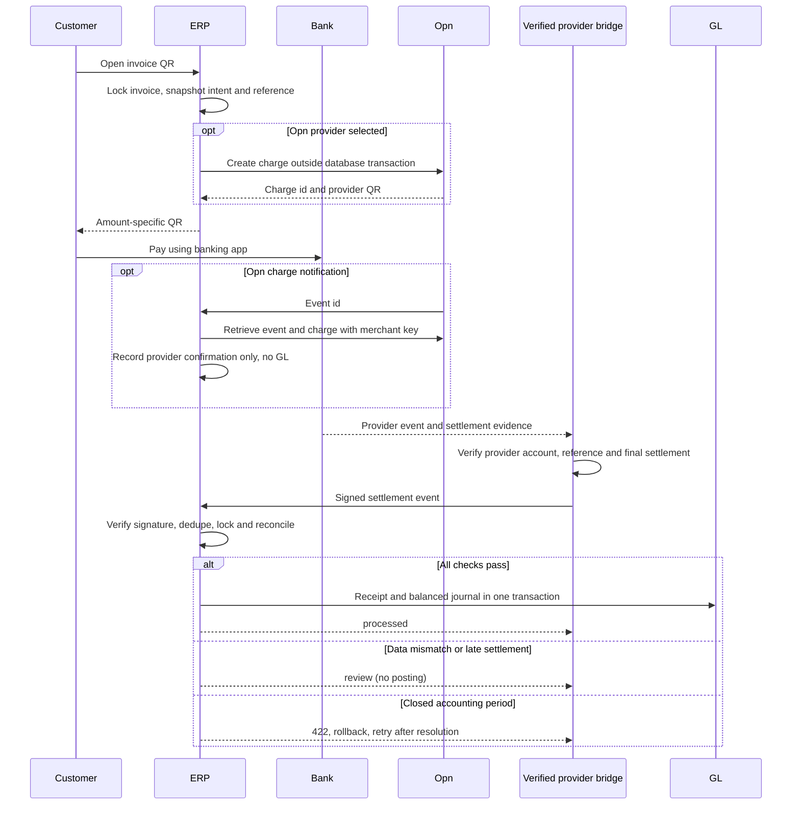

# Phase 23: PromptPay and Gateway Settlement

Status: closed on 2026-09-10 by explicit user scope decision. Implemented code, migrations and local/fixture verification are complete. Actual settlement bridge integration and provider sandbox/banking scan are deferred because the connection has not yet been requested. Closure is not live-payment certification or enablement. Do not treat the HMAC bridge as a native Omise, GB Prime Pay or 2C2P integration.

Verification on 2026-09-10: Phase 23 has 14 passing SQLite feature tests, including mocked Opn checkout, event retrieval, delayed settlement/timezone handling and test-mode posting rejection. The combined Phase 23/22 portal/15 inventory/14 and 14.1 FX/11 admin and GL/3 receipts run passed 57 tests and 325 assertions. QR portal access and invoice PDF rendering share an intent and are tested. TypeScript, scoped ESLint, Pint and Vite production build passed. MySQL verification is recorded separately below; no live provider certification is implied by fixture tests.

## Implemented flow

The organization configures a registered Biller ID (15 digits, tag 30) or a PromptPay Tax ID (13 digits, tag 29), a THB receiving bank and a settlement bridge signing secret. The feature defaults to disabled. Secrets and recipient identifiers are encrypted at rest and excluded from model serialization.

Only issued, unpaid THB invoices can produce an intent. `gateway_transactions` stores the invoice, organization, receiving bank, exact amount in satang, random reference, QR payload and a 30-minute expiry. Repeated rendering reuses an active intent for the same amount. Recipient/bank changes are blocked while active intents exist. The invoice print/PDF and customer portal use the same QR service. SVG QR images are generated locally with Endroid/Bacon and need no GD extension or external image service.

Tag 30 carries reference 1 and optional reference 2. Tag 29 cannot carry bill-payment references; an integration must independently bind a verified provider payment to the ERP transaction reference. Amount alone is never a matching key. Expiry is enforced by the ERP reconciliation gate; a printed static QR does not force a banking application to reject a late transfer. Payments made outside the valid QR window go to review. Opn payout may arrive later if the independently retrieved customer payment time was within that window.

## Settlement bridge contract

`POST /api/gateway/{config-id}/settlement` is a stateless API endpoint, separate from browser CSRF and staff authentication. It is intended for a trusted bank/provider integration bridge that has already confirmed final settlement, not direct browser requests.

Headers:

- `Content-Type: application/json`
- `X-Settlement-Timestamp`: Unix seconds, within 300 seconds of server time.
- `X-Settlement-Signature`: lowercase hex HMAC-SHA256 of `timestamp + "." + exact raw JSON bytes`, keyed by the organization's signing secret (at least 32 characters).

Example normalized body (no real credentials):

```json
{
  "event_id": "provider-event-unique-id",
  "reference": "ABCDEFGHIJKLMNOPQRST",
  "status": "settled",
  "amount_minor": 10000,
  "currency": "THB",
  "settled_at": "2026-09-09T10:00:00+07:00"
}
```

`pending` and `failed` callbacks never create a Payment. `settled` requires a valid transaction reference, exact expected amount/currency, an active same-org THB bank, an issued invoice journal and sufficient outstanding balance. For the direct HMAC bridge, settlement must fall within the intent's valid window. For Opn, the retrieved `provider_paid_at` must fall within that window and settlement must not precede payment; payout can occur days later. Accounting uses the settlement date. A closed accounting period returns 422 and rolls back all writes so the same event can be retried after the accounting issue is resolved.

Successful processing locks the config, transaction and invoice, then creates the AR receipt and existing `FinancialJournalService::postPayment` journal in one transaction. FX/base amounts follow the existing snapshot service. The payment uses `gateway:{transaction-id}` as its idempotency key. The invoice balance and state, transaction and audit trail commit together.

Duplicate event id + same body returns the saved result. The same event id with different bytes returns 409. A new event for an already posted transaction is ignored, including delayed pending/failed notifications. A mismatch returns `review` and stores a reason in `webhook_events`; no accounting entry is made. A retry after a 422 must reuse the event/body with a fresh timestamp and signature. Event payloads and secrets are not persisted in audit logs; events retain only a hash and processing outcome.

## Provider adapter decisions

| Provider | Required native verification before bridge may emit `settled` | Status |
| --- | --- | --- |
| Opn / Omise | Retrieve event/charge through authenticated provider API; validate account, amount/currency, reference and final settlement evidence. A `charge.complete` alone is insufficient evidence of bank settlement. | Native checkout and event/charge verification implemented and fixture-tested; independent settlement bridge and merchant sandbox validation still required |
| GB Prime Pay | Confirm contracted API version, signature scheme, merchant identity, inquiry result and settlement report/notification semantics. | Native adapter not implemented; provider contract pending |
| 2C2P | Verify provider JWT with merchant credentials, then validate inquiry/settlement response and reference mapping. | Native adapter not implemented; merchant/provider selection pending |

The ERP HMAC bridge is a separate documented protocol and must not be advertised as any of these providers' native webhook API. Live enablement requires a tested provider-specific bridge and a reachable HTTPS callback deployment. This local ERP can generate QR offline; receiving internet webhooks requires an appropriate deployed integration.

### Opn checkout and verification

Select `opn` in Settings with a matching test/live merchant secret key. The key is encrypted, never sent back in page props, and blank submissions preserve it. The ERP reserves an intent as `creating` before calling the fixed Opn API host to create a PromptPay charge with `metadata.erp_reference`, amount and expiry. It downloads the provider's QR from an allowlisted URL, rejects redirects and unsafe SVG, and stores a sanitized data image. It does not substitute a locally generated receiver QR for an Opn charge.

Test mode permits checkout and provider verification only. Even a signed settlement for a confirmed test charge returns `review` without Payment/GL. Automated accounting tests simulate live-mode responses with HTTP fixtures; no real merchant key is used. Provider payment and settlement timestamps are normalized to `app.timezone` (currently UTC) before persistence and accounting-date selection.

Repeated rendering reuses the pending charge. Ambiguous creation failures become `creation_unknown` and block automatic creation retries, including after expiry. Provider, mode, merchant key and receiver changes are guarded while unresolved intents exist. An operator must inspect the merchant dashboard/inquiry and establish whether a payable charge exists before manual recovery; there is no automatic reset or blind retry command.

`POST /api/gateway/{config}/opn` accepts an event ID only as a lookup hint. The server retrieves the event and charge with this organization's merchant credentials, verifies mode, paid PromptPay state, reference, amount, currency and refund state, then records `provider_confirmed`. Neither the browser nor the incoming callback's claimed payment status is trusted. This endpoint creates no Payment/GL.

For an Opn organization, the signed settlement body must additionally contain `provider_charge_id` equal to that confirmed charge. The independent bridge must obtain actual final settlement evidence and map it to the charge before emitting `settled`. Fees, net payouts, pooled settlements, refunds and chargebacks are not silently mapped to invoice receipts; mismatched amounts require finance review and a contracted settlement mapping before live rollout. No merchant credentials or real provider requests were used in automated tests.

## Data and routes

| Table | Purpose |
| --- | --- |
| `payment_gateway_configs` | One encrypted, disabled-by-default integration config per organization |
| `gateway_transactions` | Immutable expected invoice amount, reference, QR and bank snapshot; resulting payment id |
| `webhook_events` | Per-config unique event id, payload hash, outcome and review reason |

| Route | Access |
| --- | --- |
| `GET /settings/payment-gateway` | `settings.organization.view` |
| `PUT /settings/payment-gateway` | `settings.organization.update`, password confirmation and throttle |
| `GET /invoice-payment/{invoice}` | Same-org staff with `invoices.view`, or matching customer portal session |
| `POST /api/gateway/{config}/settlement` | Verified HMAC bridge, timestamp check and throttle |
| `POST /api/gateway/{config}/opn` | Merchant-authenticated API verification of event/charge; throttle; no automatic posting |

The provider-verification migration adds encrypted `provider_secret`, test/live mode, a unique `provider_charge_id`, confirmation time, verified `provider_paid_at` and sanitized QR image storage. Missing invoice base-amount snapshots or a different current organization base currency cause review, not fabricated FX postings.



## Sources

- [Bank of Thailand Thai QR Payment Standard](https://www.bot.or.th/content/dam/bot/documents/th/our-roles/payment-systems/about-payment-systems/ThaiQRCode_Payment_Standard.pdf)
- [Omise/Opn webhook verification guidance](https://docs.omise.co/api-webhooks)
- [Omise/Opn PromptPay checkout and QR contract](https://docs.omise.co/promptpay)
- [Omise/Opn Charges API](https://docs.omise.co/charges-api)
- [2C2P payment token / JWT integration documentation](https://developer.2c2p.com/v4.0.2/docs/api-payment-token)

## MySQL verification

On 2026-09-10 the Phase 23 feature and two-process concurrency suite passed **15 tests / 101 assertions** on isolated MySQL 8.0.17 (`127.0.0.1:33073`, `erp_phase23_test`). Both simultaneous identical callbacks returned the processed result while committing one Payment, one event and one payment journal. The test includes migration and rollback. Fixture customer/invoice codes respect legacy lengths, and the Phase 15 rollback now removes foreign keys and preserves the organization index before dropping columns.

The configured local `erp` database at `127.0.0.1:3306` also completed the four pending Phase 21-23 migrations as batch 14. No reset, rollback or test fixtures were run against that database. The disposable MySQL server is shut down after testing; its files remain under `temp/phase23-mysql-20260909`.

## Deferred Live Integration

Outside Phase 23 closure per the user's decision on 2026-09-10. Resume only when the connection is requested and merchant prerequisites are available. These remain prerequisites for live enablement, not completed work. No runtime settings or security/accounting checks were changed to close the phase.

- Provision the actual merchant account and independent settlement bridge, obtain credentials outside chat, and verify final settlement semantics against the contract and sandbox. Opn checkout/verification code does not replace this gate.
- Verify banking-app scan and sandbox end-to-end callback before production enablement.
