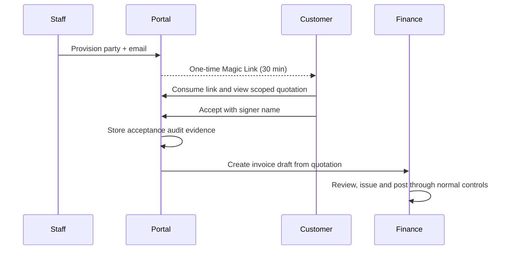

# Module: Customer & Supplier Self-Service Portals

## Purpose

ให้ลูกค้าและคู่ค้าใช้งานข้อมูลที่ได้รับอนุญาตโดยไม่ใช้บัญชีพนักงานของ ERP. Portal ใช้ Magic Link แบบ passwordless และมี session แยกจาก Laravel staff authentication.

## External identity and session

- Staff ที่มี `users.create` provision `portal_users` ตาม `org_id`, party type, party id และ email.
- Magic Link เก็บเฉพาะ SHA-256 hash ใน `portal_access_tokens`, มีอายุ 30 นาที และใช้ได้ครั้งเดียว.
- เมื่อแลก token สำเร็จ ระบบออก `erp_portal_session` แบบ HttpOnly/SameSite=Lax อายุ 8 ชั่วโมง; `portal_sessions` เก็บ hash, IP/User-Agent hash, last seen และสถานะ revoked.
- Sign out revoke session ทันที. Portal identity ไม่สามารถเข้า staff routes หรือรับ staff permissions.

## Scoped capabilities

| Identity | Read | Write |
| --- | --- | --- |
| Customer | Quotation, invoice และ DMS documents ที่ link กับ customer | Accept quotation ที่มีสถานะ `sent` และยังไม่หมดอายุ |
| Supplier | Purchase order, AP payment status, bill submissions และ DMS documents เช่น 50 ทวิที่ staff link กับ supplier | Upload vendor bill เข้า quarantine intake |

ทุก query ตรวจ `org_id` และ `party_type`/`party_id`; access ข้าม party หรือข้ามองค์กรตอบ `404`.

## Quotation acceptance

1. Customer เปิด quotation ที่ได้รับ scope.
2. ยืนยันชื่อผู้ยอมรับ.
3. ระบบบันทึก `quotation_acceptances` พร้อม timestamp และ hashed IP/User-Agent.
4. Transaction เดียวกันสร้าง Invoice `draft`, copy quotation items, และ mark quotation เป็น `converted`.
5. เขียน audit `portal_quotation.accepted`.

Invoice ยังเป็น draft เพื่อให้ฝ่ายการเงินตรวจทานก่อนส่งหรือ post.

## Vendor bill intake and documents

- รับเฉพาะ PDF/JPG/JPEG/PNG/WebP ขนาดไม่เกิน 5 MB.
- ไฟล์เก็บ private local storage ใต้ tenant, สร้าง DMS `Document` + `DocumentVersion` เป็น `pending_scan` และ `finance_confidential`.
- สร้าง `vendor_bill_submissions` สถานะ `pending_scan`; ไม่มีการสร้าง Expense/AP draft หรือ GL posting จาก portal.
- Download ผ่าน `PortalController::download` เท่านั้นเมื่อ document link เป็น party เดียวกัน, version `clean`, และ storage key มีอยู่จริง. ไม่มี public URL.

## Main routes

| Route | Function |
| --- | --- |
| `GET /portal/access/{token}` | Consume one-time Magic Link |
| `GET /portal/sign-in` | Guest portal access page |
| `GET /portal` | Scoped portal dashboard |
| `POST /portal/logout` | Revoke portal session |
| `POST /portal/quotations/{quotation}/accept` | Customer acceptance |
| `POST /portal/vendor-bills` | Supplier bill intake |
| `GET /portal/document-versions/{version}/download` | Private clean-file download |

## Verification

`tests/Feature/Phase22PortalTest.php` verifies one-time Magic Link use, portal data isolation, quotation acceptance/invoice creation/audit, vendor-bill quarantine, and blocked download before scan clearance.
