# ผังแบบจำลองฐานข้อมูลทั้งระบบ (Complete Database ER Diagram — 50+ Tables)

เอกสารนี้รวบรวม **Entity Relationship (ER) Diagram ฉบับสมบูรณ์ของระบบ Company OS / Lightweight ERP ทั้งหมด 50+ ตาราง** อ้างอิงตามโครงสร้างฐานข้อมูลกลาง [`docs/database/DATABASE.md`](file:///c:/LocalDevine/www/ERP/docs/database/DATABASE.md) (Single Source of Truth) ครอบคลุมฟังก์ชันตั้งแต่ Phase 0 ถึง Phase 18 พร้อมคำอธิบายความสัมพันธ์, Primary Keys, Foreign Keys, Constraints, และกฎทางธุรกิจภาษาไทยอย่างละเอียด

---

## 📑 สารบัญโดเมนฐานข้อมูล (Database Domains)

1. [ภาพรวมความสัมพันธ์ระหว่างโดเมนทั้งระบบ (Master System-Wide ERD)](#1-ภาพรวมความสัมพันธ์ระหว่างโดเมนทั้งระบบ-master-system-wide-erd)
2. [Domain 1: โครงสร้างองค์กรและระบบผู้ใช้ (Foundation & IAM)](#2-domain-1-โครงสร้างองค์กรและระบบผู้ใช้-foundation--iam)
3. [Domain 2: ลูกค้าสัมพันธ์และโอกาสการขาย (CRM & Sales)](#3-domain-2-ลูกค้าสัมพันธ์และโอกาสการขาย-crm--sales)
4. [Domain 3: การบริหารโครงการและงานส่งมอบ (Projects & Delivery)](#4-domain-3-การบริหารโครงการและงานส่งมอบ-projects--delivery)
5. [Domain 4: การเงิน ใบแจ้งหนี้ รับชำระ และการจัดซื้อ (Finance, Billing & Procurement)](#5-domain-4-การเงิน-ใบแจ้งหนี้-รับชำระ-และการจัดซื้อ-finance-billing--procurement)
6. [Domain 5: คลังสินค้าและสินค้าคงคลัง (Warehouse & Inventory - Phase 8, 15)](#6-domain-5-คลังสินค้าและสินค้าคงคลัง-warehouse--inventory)
7. [Domain 6: Payroll & สวัสดิการ (Phase 16B)](#7-domain-6-payroll-phase-16b)
8. [Domain 7: สินทรัพย์ถาวรและค่าเสื่อมราคา (Fixed Assets & Depreciation - Phase 13)](#8-domain-7-สินทรัพย์ถาวรและค่าเสื่อมราคา-fixed-assets--depreciation---phase-13)
9. [Domain 8: สกุลเงินและอัตราแลกเปลี่ยน (Multi-Currency & FX - Phase 14)](#9-domain-8-สกุลเงินและอัตราแลกเปลี่ยน-multi-currency--fx---phase-14)
10. [Domain 9: ใบกำกับภาษีอิเล็กทรอนิกส์ (E-Tax & Invoicing - Phase 12)](#10-domain-9-ใบกำกับภาษีอิเล็กทรอนิกส์-e-tax--invoicing---phase-12)
11. [Domain 10: ระบบจัดการเอกสารองค์กร (Enterprise DMS & Retention - Phase 17)](#11-domain-10-ระบบจัดการเอกสารองค์กร-enterprise-dms--retention---phase-17)
12. [Domain 11: ความปลอดภัยและการยืนยันตัวตน 2FA (Security & Two-Factor - Phase 18)](#12-domain-11-ความปลอดภัยและการยืนยันตัวตน-2fa-security--two-factor---phase-18)
13. [Domain 12: แพลตฟอร์ม บันทึกประวัติ และการเชื่อมต่อระบบ (Platform & Integrations)](#13-domain-12-แพลตฟอร์ม-บันทึกประวัติ-และการเชื่อมต่อระบบ-platform--integrations)
14. [มาตรฐานและกฎข้อบังคับของฐานข้อมูล (Database Conventions & Strict Rules)](#14-มาตรฐานและกฎข้อบังคับของฐานข้อมูล-database-conventions--strict-rules)

---

## 1. ภาพรวมความสัมพันธ์ระหว่างโดเมนทั้งระบบ (Master System-Wide ERD)

ผังแสดงความสัมพันธ์ระดับแกนกลาง (Core Entities) ระหว่าง 12 โดเมนหลักในระบบ

```mermaid
erDiagram
    ORGANIZATIONS ||--o{ BRANCHES : "1:N แบ่งสาขา"
    BRANCHES ||--o{ DIVISIONS : "1:N แบ่งสายงาน"
    DIVISIONS ||--o{ DEPARTMENTS : "1:N แบ่งแผนก"
    DEPARTMENTS ||--o{ USERS : "1:N สังกัดผู้ใช้"
    
    ORGANIZATIONS ||--o{ USERS : "1:N เจ้าของบัญชี"
    ORGANIZATIONS ||--o{ CUSTOMERS : "1:N ครอบครองลูกค้า"
    ORGANIZATIONS ||--o{ PRODUCTS : "1:N แคตตาล็อกสินค้า"
    ORGANIZATIONS ||--o{ SUPPLIERS : "1:N คู่ค้า/ผู้จำหน่าย"
    ORGANIZATIONS ||--o{ WAREHOUSES : "1:N คลังสินค้า"
    ORGANIZATIONS ||--o{ EMPLOYEE_PAYROLL_PROFILES : "1:N payroll profiles"
    ORGANIZATIONS ||--o{ FIXED_ASSETS : "1:N ทะเบียนสินทรัพย์"
    ORGANIZATIONS ||--o{ DOCUMENTS : "1:N เอกสารองค์กร"

    CUSTOMERS ||--o{ CONTACTS : "1:N รายชื่อผู้ติดต่อ"
    CUSTOMERS ||--o{ DEALS : "1:N เปิดโอกาสการขาย"
    CUSTOMERS ||--o{ QUOTATIONS : "1:N ออกใบเสนอราคา"
    CUSTOMERS ||--o{ INVOICES : "1:N ออกใบแจ้งหนี้"
    CUSTOMERS ||--o{ PORTAL_USERS : "1:N ผู้ใช้พอร์ทัลลูกค้า"

    DEALS ||--o{ QUOTATIONS : "1:N จัดทำใบเสนอราคา"
    DEALS ||--o{ PROJECTS : "1:N (Won) เปิดโปรเจกต์ส่งมอบ"
    
    PROJECTS ||--o{ MILESTONES : "1:N แบ่งงวดงาน"
    MILESTONES ||--o{ TASKS : "1:N งานย่อยในงวด"
    PROJECTS ||--o{ TASKS : "1:N งานย่อยทั้งหมด"
    PROJECTS o|--o{ INVOICES : "0..1:N อ้างอิงเรียกเก็บเงิน"
    PROJECTS o|--o{ EXPENSES : "0..1:N ผูกต้นทุนโครงการ"

    INVOICES ||--o{ INVOICE_ITEMS : "1:N รายการในบิล"
    INVOICES ||--o{ PAYMENTS : "1:N บันทึกรับชำระ"
    INVOICES ||--o| ETAX_DOCUMENTS : "1:0..1 ใบกำกับภาษี e-Tax"
    PRODUCTS ||--o{ INVOICE_ITEMS : "1:N อ้างอิงราคาขาย"
    
    SUPPLIERS ||--o{ PURCHASE_ORDERS : "1:N สั่งซื้อสินค้า"
    PURCHASE_ORDERS ||--o{ PURCHASE_ORDER_ITEMS : "1:N รายการสั่งซื้อ"
    PRODUCTS ||--o{ PURCHASE_ORDER_ITEMS : "1:N สินค้าที่สั่งซื้อ"
    WAREHOUSES ||--o{ WAREHOUSE_BINS : "1:N ตำแหน่งจัดเก็บ"
    WAREHOUSES ||--o{ STOCK_MOVEMENTS : "1:N ความเคลื่อนไหวสต็อก"
    PRODUCTS ||--o{ INVENTORY_LOTS : "1:N รุ่นผลิต/วันหมดอายุ"

    USERS ||--o| EMPLOYEE_PAYROLL_PROFILES : "0..1:1 profile"
    PAYROLL_TAX_POLICIES ||--o{ PAYROLL_RUNS : "locked policy"
    SOCIAL_SECURITY_POLICIES ||--o{ PAYROLL_RUNS : "locked policy"
    PAYROLL_RUNS ||--o{ PAYROLL_ITEMS : "1:N calculation"
    USERS ||--o{ PAYROLL_ITEMS : "receives payslip"
    USERS ||--o{ TWO_FACTOR_TRUSTED_DEVICES : "1:N trusted devices"
    DOCUMENTS ||--o{ DOCUMENT_VERSIONS : "1:N version history"
    DOCUMENTS ||--o{ DOCUMENT_LINKS : "1:N polymorphic links"
```

---

## 2. Domain 1: โครงสร้างองค์กรและระบบผู้ใช้ (Foundation & IAM)

ครอบคลุมการแบ่ง Tenant, ลำดับชั้นองค์กร, และระบบสิทธิ์ RBAC 7 บทบาท (`owner`, `admin`, `sales`, `project_manager`, `finance`, `member`, `viewer`)

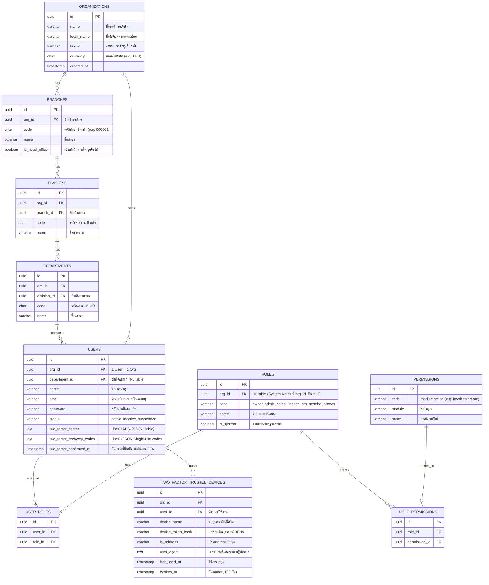

---

## 3. Domain 2: ลูกค้าสัมพันธ์และโอกาสการขาย (CRM & Sales)

ครอบคลุมฐานข้อมูลลูกค้า, รายชื่อผู้ติดต่อ, ท่อโอกาสการขาย (Deals), ประวัติกิจกรรมติดตาม, และใบเสนอราคา (Quotations)

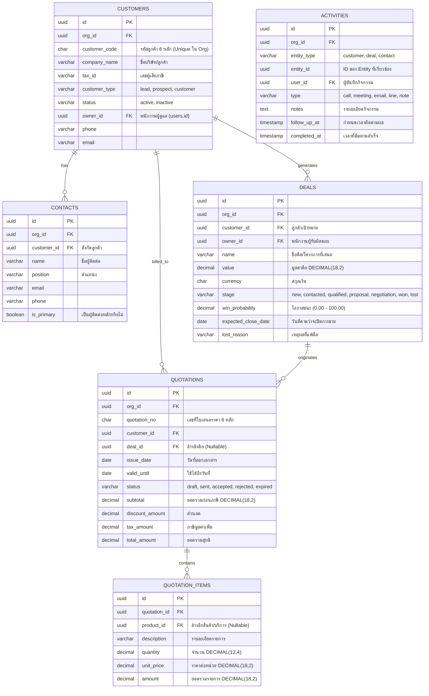

---

## 4. Domain 3: การบริหารโครงการและงานส่งมอบ (Projects & Delivery)

ครอบคลุมโครงการที่เกิดจาก Deal Won หรือสร้างโดยตรง, งวดงาน (Milestones), งานย่อย (Tasks), Checklists, และข้อคิดเห็น (Comments)

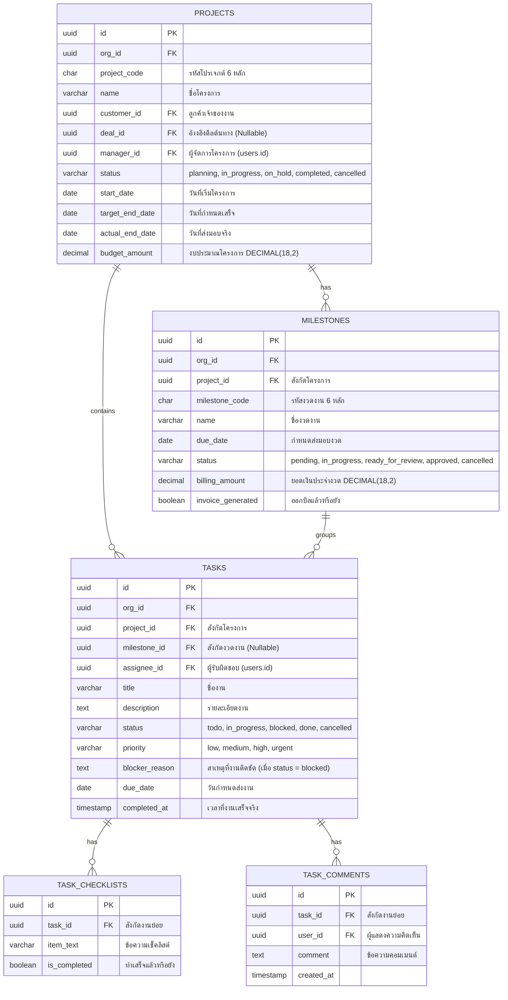

---

## 5. Domain 4: การเงิน ใบแจ้งหนี้ รับชำระ และการจัดซื้อ (Finance, Billing & Procurement)

ครอบคลุมแคตตาล็อกสินค้า, ใบแจ้งหนี้ (Invoices), การรับเงิน (Payments), ค่าใช้จ่าย (Expenses), คู่ค้า (Suppliers), และใบสั่งซื้อ (Purchase Orders)

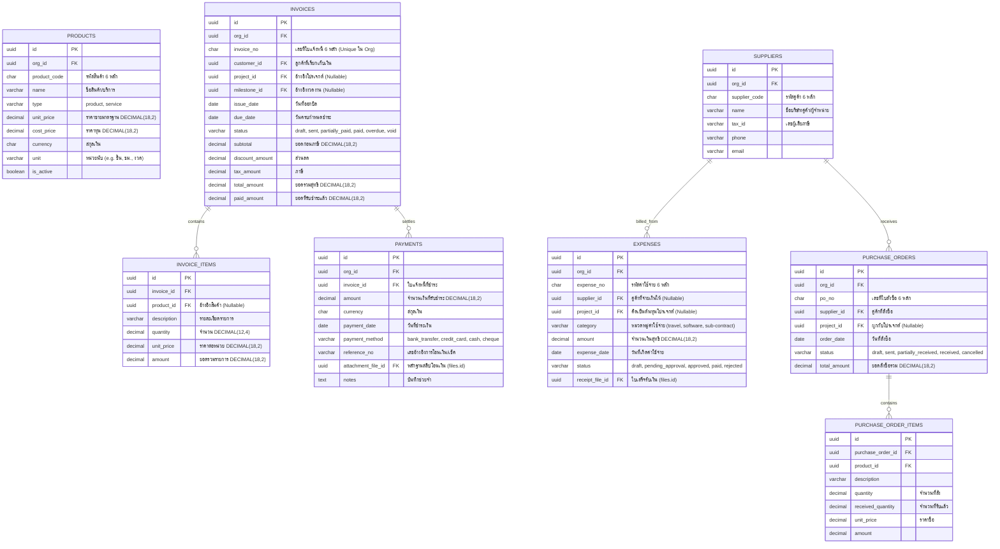

---

## 6. Domain 5: คลังสินค้าและสินค้าคงคลัง (Warehouse & Inventory - Phase 8, 15)

ครอบคลุมคลังสินค้า, ตำแหน่งจัดเก็บย่อย (Bin Locations), การโอนย้ายสต็อก (Stock Transfers), การควบคุมรุ่นผลิตและวันหมดอายุ (Inventory Lots), และประวัติการเคลื่อนไหวสต็อก (Stock Movement Ledger)

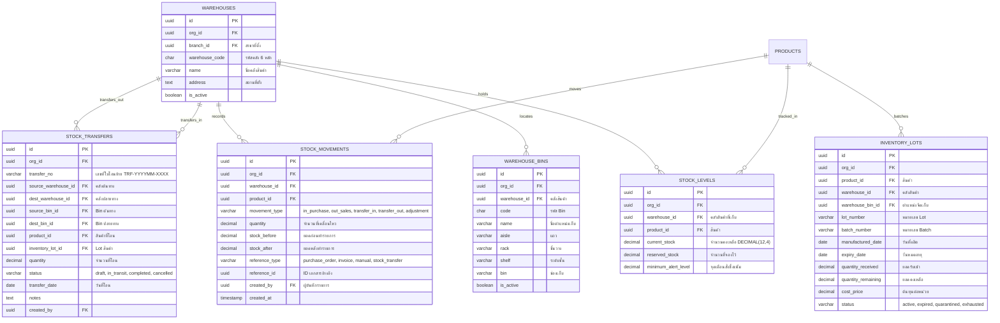

---

## 7. Domain 6: Payroll (Phase 16B)

Phase 16B implement payroll บน `users` โดยตรง. Employee master, attendance, leave และ OT เป็น scope อนาคต จึงไม่แสดงเป็นตารางจริงใน ERD นี้.

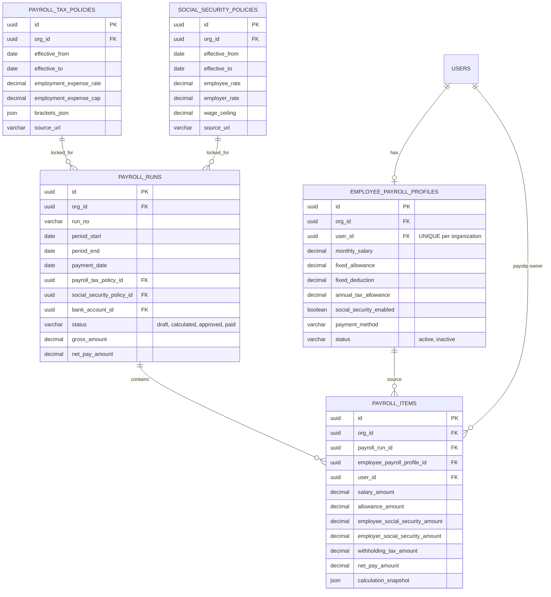

---

## 8. Domain 7: สินทรัพย์ถาวรและค่าเสื่อมราคา (Fixed Assets & Depreciation - Phase 13)

ครอบคลุมหมวดหมู่สินทรัพย์, ทะเบียนสินทรัพย์ถาวร, การคำนวณค่าเสื่อมราคารายเดือนเส้นตรง (Straight-Line), การบันทึกลงบัญชีแยกประเภททั่วไป (General Ledger) และการจำหน่าย/ตัดจำหน่ายสินทรัพย์

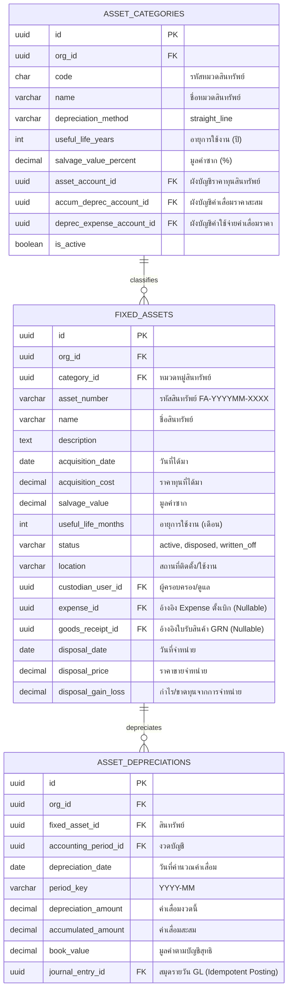

---

## 9. Domain 8: สกุลเงินและอัตราแลกเปลี่ยน (Multi-Currency & FX - Phase 14)

ครอบคลุมมาสเตอร์สกุลเงิน, อัตราแลกเปลี่ยนย้อนหลังตามวันทำรายการ, Snapshot อัตราแลกเปลี่ยนในเอกสาร และการประเมินมูลค่าย้อนหลังสิ้นงวด (FX Revaluation)

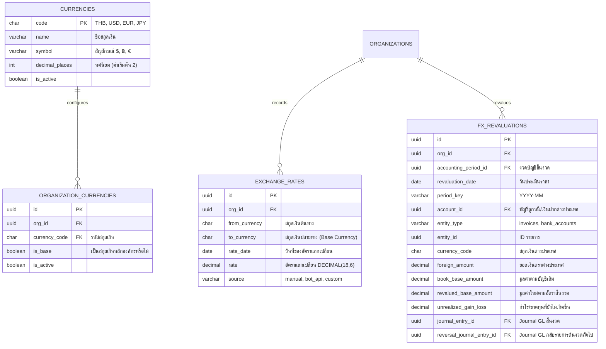

---

## 10. Domain 9: ใบกำกับภาษีอิเล็กทรอนิกส์ (E-Tax & Invoicing - Phase 12)

ครอบคลุมการออกใบกำกับภาษีและใบเสร็จอิเล็กทรอนิกส์ e-Tax Invoice / Receipt ตามมาตรฐานขมธอ. (ETDA), XML Generation, การจัดเก็บ Private Storage, SHA256 Integrity Hash, และการส่งออกข้อมูล RD Prep สำหรับยื่นกรมสรรพากร

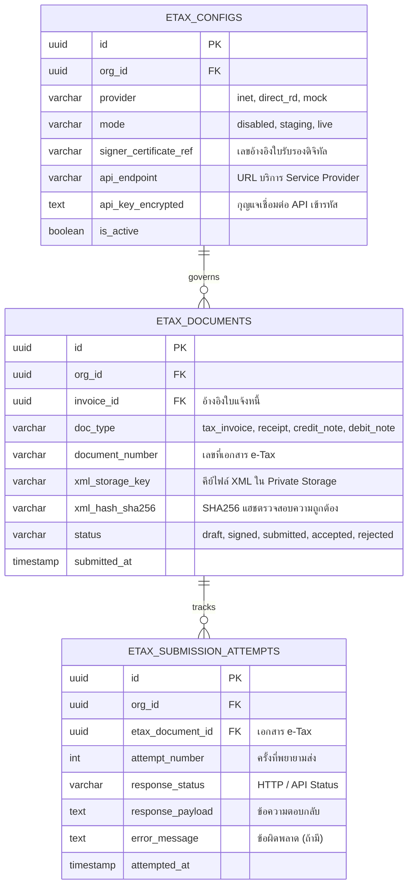

---

## 11. Domain 10: ระบบจัดการเอกสารองค์กร (Enterprise DMS & Retention - Phase 17)

ครอบคลุมระบบคลังเอกสารอิเล็กทรอนิกส์ (DMS), การแบ่งหมวดหมู่, การควบคุมระดับชั้นความลับ (Sensitivity RBAC), ประวัติเวอร์ชันเอกสารพร้อม SHA256 Checksum, การเชื่อมโยงแบบ Polymorphic กับเอกสารธุรกิจ, และนโยบายการจัดเก็บ/ทำลาย (Retention Policy) พร้อม Legal Hold

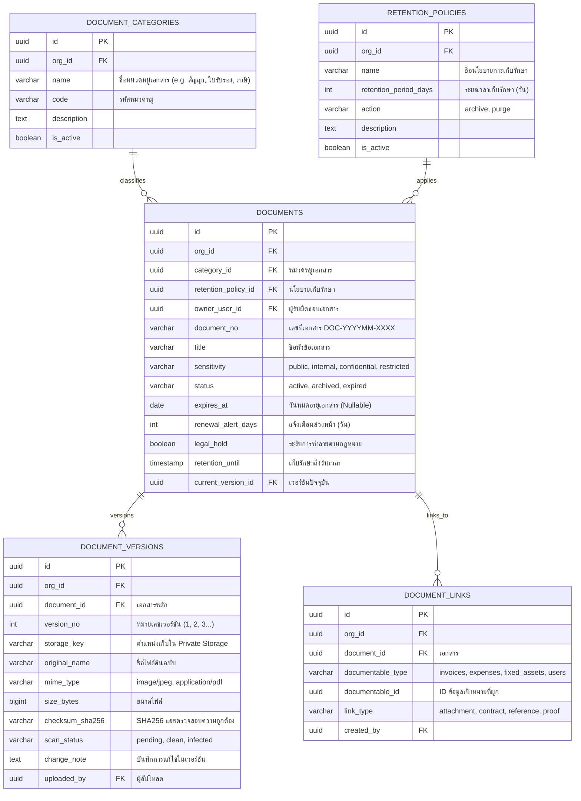

---

## 12. Domain 11: ความปลอดภัยและการยืนยันตัวตน 2FA (Security & Two-Factor - Phase 18)

ครอบคลุมความปลอดภัยการเข้าสู่ระบบแบบยืนยันตัวตนสองขั้นตอน (TOTP RFC 6238), การเข้ารหัส Secret Key (AES-256-GCM), รหัสกู้คืนฉุกเฉินครั้งเดียว (Single-Use Recovery Codes), และทะเบียนอุปกรณ์ที่เชื่อถือได้ (Trusted Devices 30 วัน)

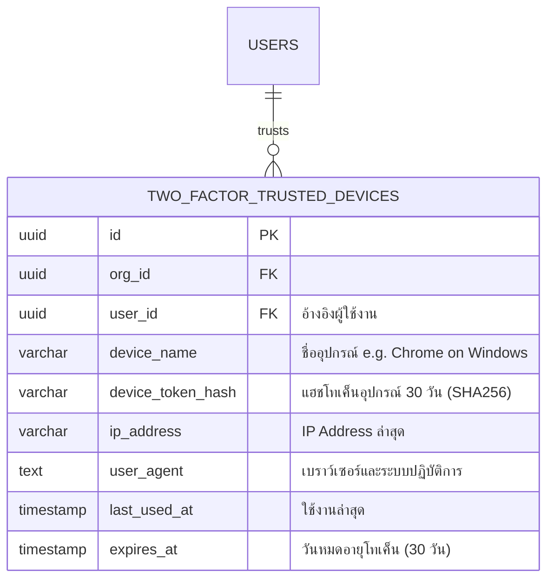

---

## 13. Domain 12: แพลตฟอร์ม บันทึกประวัติ และการเชื่อมต่อระบบ (Platform & Integrations)

ครอบคลุมไฟล์แนบ (Files), การแจ้งเตือน (Notifications), ประวัติการใช้งาน (Audit Logs), กฎอัตโนมัติ (Automation Rules), การ Sync บัญชีภายนอก และ Customer Portal

```mermaid
erDiagram
    FILES {
        uuid id PK
        uuid org_id FK
        varchar entity_type "invoices, payments, expenses, customers"
        uuid entity_id "ID ของข้อมูลที่ไฟล์แนบอยู่"
        varchar original_name "ชื่อไฟล์เดิมที่อัปโหลด"
        varchar storage_path "ที่อยู่ไฟล์ใน Storage (Local / S3)"
        varchar mime_type "image/png, application/pdf"
        bigint file_size "ขนาดไฟล์ (Bytes)"
        uuid uploaded_by FK "ผู้อัปโหลด"
    }

    AUDIT_LOGS {
        uuid id PK
        uuid org_id FK
        uuid user_id FK "ผู้ทำรายการ"
        varchar entity_type "ชื่อตารางข้อมูล"
        uuid entity_id "ID ข้อมูลที่ถูกแก้"
        varchar action "created, updated, deleted, login, export"
        json old_values "ค่าข้อมูลเดิมก่อนแก้ไข"
        json new_values "ค่าข้อมูลใหม่หลังแก้ไข"
        varchar ip_address "IP Address"
        timestamp created_at "บันทึกเวลา (ห้ามแก้ไข)"
    }

    NOTIFICATIONS {
        uuid id PK
        uuid org_id FK
        uuid user_id FK "ผู้รับการแจ้งเตือน"
        varchar type "system_alert, task_assigned, invoice_overdue"
        varchar title "หัวข้อแจ้งเตือน"
        text message "เนื้อหาข้อความ"
        boolean is_read "เปิดอ่านแล้วหรือยัง"
        timestamp read_at
    }

    AUTOMATION_RULES {
        uuid id PK
        uuid org_id FK
        varchar name "ชื่อกฎการทำงานอัตโนมัติ"
        varchar trigger_event "deal.won, invoice.paid, task.blocked"
        json conditions "เงื่อนไข (JSON)"
        json actions "การกระทำ (ส่ง Notify, ออก Task, เรียก Webhook)"
        boolean is_active
    }

    AUTOMATION_LOGS {
        uuid id PK
        uuid org_id FK
        uuid rule_id FK
        varchar status "success, failed"
        text execution_details "ผลลัพธ์การทำงาน"
        timestamp executed_at
    }

    WEBHOOK_EVENTS {
        uuid id PK
        uuid org_id FK
        varchar event_type "invoice.settled, customer.created"
        varchar target_url "URL ปลายทาง"
        json payload_json "ข้อมูลที่ส่งออก"
        varchar status "pending, delivered, failed"
        int attempts "จำนวนครั้งที่พยายามส่ง"
        text last_error
    }

    NUMBER_SEQUENCES {
        uuid id PK
        uuid org_id FK
        uuid branch_id FK "Nullable"
        varchar doc_type "branch, customer, project, invoice, expense, po"
        varchar prefix "คำนำหน้า (e.g. INV, PRJ)"
        int year "ปี พ.ศ./ค.ศ."
        int last_number "ตัวเลขล่าสุด (0 - 999999)"
    }

    SETTINGS {
        uuid id PK
        uuid org_id FK
        varchar key "ชื่อการตั้งค่า (Unique ใน Org)"
        json value_json "ค่าคอนฟิก"
    }

    ACCOUNTING_SYNC_LOGS {
        uuid id PK
        uuid org_id FK
        varchar provider "flowaccount, peak, xero, quickbooks"
        varchar entity_type "customer, invoice, payment, expense"
        uuid entity_id "ID ข้อมูลใน ERP"
        varchar external_id "ID ข้อมูลในโปรแกรมบัญชีภายนอก"
        varchar direction "push, pull"
        varchar status "pending, success, failed"
        text error_message
    }

    PORTAL_USERS {
        uuid id PK
        uuid org_id FK
        uuid customer_id FK "ผูกกับลูกค้า"
        varchar email "อีเมลล็อกอินพอร์ทัล"
        varchar password "รหัสผ่านที่แฮชแล้ว"
        varchar status "active, inactive"
        timestamp last_login_at
    }

    AUTOMATION_RULES ||--o{ AUTOMATION_LOGS : "logs"
```

---

## 14. มาตรฐานและกฎข้อบังคับของฐานข้อมูล (Database Conventions & Strict Rules)

1. **ระบบคีย์หลัก (Primary Keys):**  
   - ทุกตารางใช้ Primary Key ชื่อ `id` เป็นชนิด **Time-Ordered UUID (UUIDv7)** เพื่อประสิทธิภาพในการทำ Indexing และป้องกันการคาดเดา ID ข้อมูล
2. **การแยกข้อมูลตามผู้เช่า (Multi-Tenant Isolation):**  
   - ตารางธุรกิจเกือบทุกตารางมีคอลัมน์ `org_id` (FK &rarr; `organizations.id`) และต้องใส่ `WHERE org_id = ?` ในทุก Query ป้องกันข้อมูลรั่วไหลข้ามบริษัท
3. **ความแม่นยำของตัวเลขการเงิน (Monetary Fields):**  
   - จำนวนเงิน, ยอดรวม, ภาษี, และราคาทุกฟิลด์ถูกกำหนดเป็น `DECIMAL(18,2)` อย่างเข้มงวด ห้ามใช้ Float หรือ Double เพื่อป้องกันปัญหาเศษสตางค์คลาดเคลื่อน
4. **รหัสธุรกิจที่ผู้ใช้มองเห็น (Display Codes):**  
   - รหัสที่แสดงผลบนหน้าจอ เช่น `customer_code`, `project_code`, `invoice_no`, `po_no`, `branch.code` จะใช้เป็น **ข้อความตัวเลข 6 หลัก (Format 000001 - 999999)** ควบคุมการออกเลขด้วยตาราง `number_sequences` (Atomic Lock)
5. **การลบข้อมูลแบบ Soft Delete:**  
   - ตารางธุรกิจหลัก (Customers, Deals, Projects, Tasks, Invoices, Expenses) รองรับคอลัมน์ `deleted_at` เพื่อให้สามารถกู้คืนข้อมูลและตรวจสอบย้อนหลังได้
6. **ประวัติกิจกรรมที่ไม่สามารถแก้ไขได้ (Immutable Audit Trail):**  
   - ตาราง `audit_logs` และ `stock_movements` เป็นแบบ **Append-Only** ไม่อนุญาตให้แก้ไขหรือลบ เพื่อความโปร่งใสสูงสุดของระบบ ERP
