# คู่มือและผังการทำงาน 6 กลุ่มโมดูลหลัก (Domain Group Workflows — 31 Modules)

เอกสารนี้รวบรวม **Diagram ผังการทำงาน, วงจรสถานะ (Lifecycle), และลำดับการทำงาน (Sequence)** ของทั้ง **6 กลุ่มงานหลัก ครอบคลุม 31 โมดูลทั้งหมด** ของระบบ Company OS / Lightweight ERP พร้อมคำอธิบายภาษาไทยอย่างละเอียดในทุกขั้นตอน

---

## 📑 สารบัญกลุ่มงาน (Table of Domain Groups)

| กลุ่ม | ชื่อกลุ่มงาน | โมดูลที่ครอบคลุม | จำนวน Diagram | รายละเอียดโดยสังเขป |
|:---:|---|---|:---:|---|
| **Group 1** | [Foundation & Security](#group-1-foundation--security-โมดูล-01-04) | `01-04` (Org, User/Role, Settings, Audit) | 3 | โครงสร้างองค์กร, สิทธิ์ RBAC 7 บทบาท, และ Audit Trail |
| **Group 2** | [CRM & Sales Pipeline](#group-2-crm--sales-pipeline-โมดูล-05-08) | `05-08` (Customers, Contacts, Deals, Quotations) | 3 | รับ Lead &rarr; จัดการผู้ติดต่อ &rarr; ดัน Deal &rarr; ออกใบเสนอราคา |
| **Group 3** | [Project Delivery & Execution](#group-3-project-delivery--execution-โมดูล-09-11) | `09-11` (Projects, Tasks, Milestones) | 3 | แปลง Deal สู่ Project &rarr; จ่ายงาน Tasks &rarr; ตรวจรับ Milestones |
| **Group 4** | [Finance, Billing & Cost Control](#group-4-finance-billing--cost-control-โมดูล-12-16) | `12-16` (Products, Suppliers, Invoices, Payments, Expenses) | 3 | ออกบิล &rarr; รับเงิน (Anti-Overpay) &rarr; บันทึกรายจ่ายและคู่ค้า |
| **Group 5** | [Insights, Platform & Automation](#group-5-insights-platform--automation-โมดูล-17-23) | `17-23` (Dashboard, Reports, Files, Notifications, Automation, Import/Export, API) | 3 | Event Trigger, Data Pipeline ขึ้น Dashboard, และระบบไฟล์แนบ |
| **Group 6** | [Operations & Advanced Extensions](#group-6-operations--advanced-extensions-phase-7-18) | `24-31` (PO, Inventory, Payroll, AI, Accounting, Portal) | 3 | สั่งซื้อสินค้า, สต็อก, เงินเดือน และเชื่อมระบบภายนอก |

---

## 🗺️ ภาพรวมความเชื่อมโยงระหว่าง 6 กลุ่มงาน (High-Level Interaction)

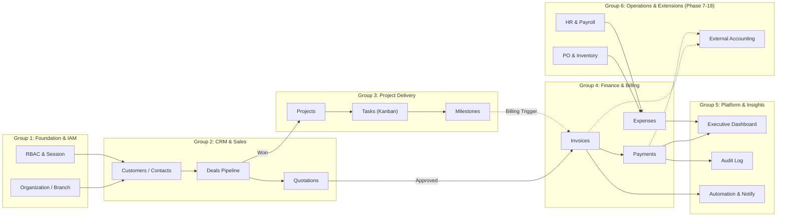

---

## Group 1: Foundation & Security (โมดูล 01-04)
**โมดูลที่เกี่ยวข้อง:** `01-organization`, `02-user-role-permission`, `03-settings`, `04-audit-log`

### 1.1 Diagram: Org Hierarchy & Multi-Tenancy Scoping Flow
ผังแสดงลำดับชั้นองค์กรและการจำกัดสิทธิ์ข้อมูลด้วย `org_id`

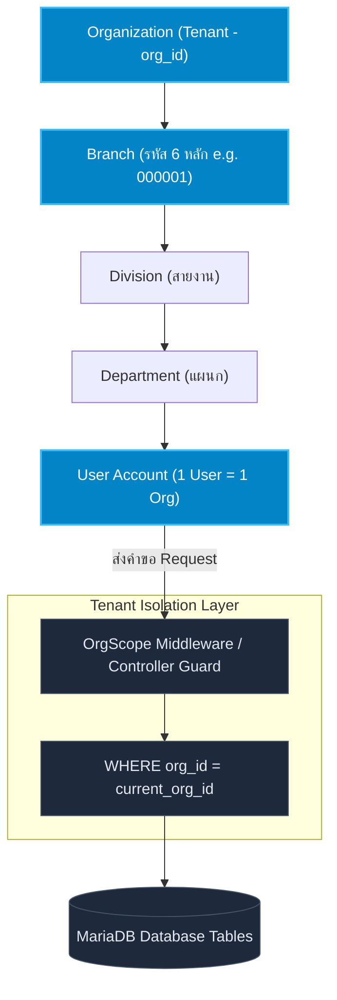

**คำอธิบายการทำงาน (Workflow Description):**
1. **ระดับชั้นสูงสุด (Root Tenant):** องค์กร (`Organization`) ถูกระบุด้วย `org_id` ซึ่งเป็น Partition สูงสุดของข้อมูล
2. **โครงสร้างสาขาและสายงาน:** ภายใต้องค์กรสามารถมีหลายสาขา (`Branch`) ระบุด้วยรหัส 6 หลัก (เช่น สำนักงานใหญ่ `000001`), มีสายงาน (`Division`), แผนก (`Department`)
3. **ผู้ใช้งาน (User):** ผู้ใช้ 1 คนจะผูกกับ 1 องค์กร และสังกัดแผนกที่กำหนด
4. **Tenant Isolation Guard:** ทุก Controller และ Model Query จะถูกบังคับใส่เงื่อนไข `WHERE org_id = current_org_id` เสมอ เพื่อป้องกันไม่ให้ข้อมูลข้ามองค์กรกัน

---

### 1.2 Diagram: RBAC Permission Resolution Flow
ลำดับขั้นตอนการตรวจสอบสิทธิ์ 7 บทบาทหลัก

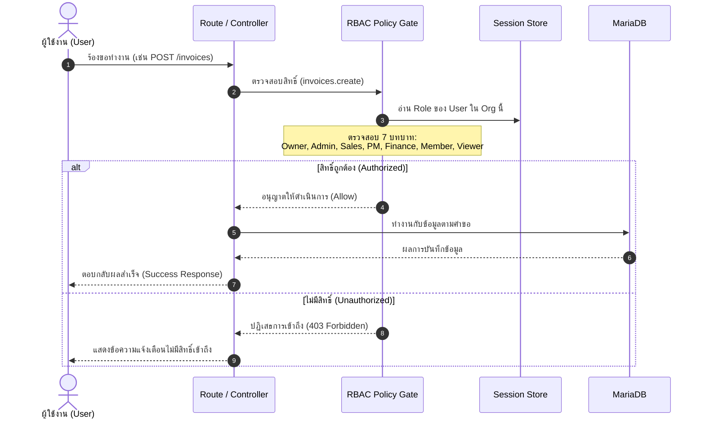

**คำอธิบายบทบาทและสิทธิ์ (Role & Permission Rules):**
- **Owner / Admin:** จัดการได้ทุกโมดูลในองค์กร ตั้งค่าระบบ และจัดการผู้ใช้
- **Sales:** จัดการลูกค้า (CRM), Contacts, Deals, และดูใบเสนอราคา/บิลที่เกี่ยวข้องได้
- **Project Manager (PM):** บริหาร Projects, Tasks, Milestones และดูต้นทุนโครงการ
- **Finance:** มีสิทธิ์เต็มในโมดูล Invoices, Payments, Expenses, และรายงานการเงิน
- **Member:** ผู้ใช้งานทั่วไป ทำงานกับ Tasks ที่ได้รับมอบหมาย และบันทึกเวลาทำงาน
- **Viewer:** สิทธิ์ดูข้อมูลอย่างเดียว (Read-only) ไม่สามารถสร้างหรือแก้ไขได้

---

### 1.3 Diagram: Application Audit Logging Trail
ผังการบันทึกประวัติการเปลี่ยนแปลงข้อมูลที่ไม่สามารถลบได้ (Immutable Log)

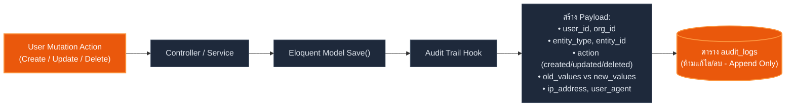

**คำอธิบายกฎการบันทึก (Audit Rules):**
1. ทุกเหตุการณ์ที่เปลี่ยนแปลงข้อมูลการเงิน, สถานะสิทธิ์, หรือข้อมูลธุรกิจหลัก จะถูกบันทึกอัตโนมัติ
2. ตาราง `audit_logs` เป็นแบบ Append-Only ไม่เปิดให้ลบหรือแก้ไข เพื่อความโปร่งใสและตรวจสอบย้อนหลังได้ 100%

---

## Group 2: CRM & Sales Pipeline (โมดูล 05-08)
**โมดูลที่เกี่ยวข้อง:** `05-crm`, `06-contacts`, `07-deals`, `08-quotations`

### 2.1 Diagram: Lead-to-Quote Sales Process Flow
กระบวนการขายตั้งแต่ได้ลูกค้ารายใหม่จนถึงปิดการขาย

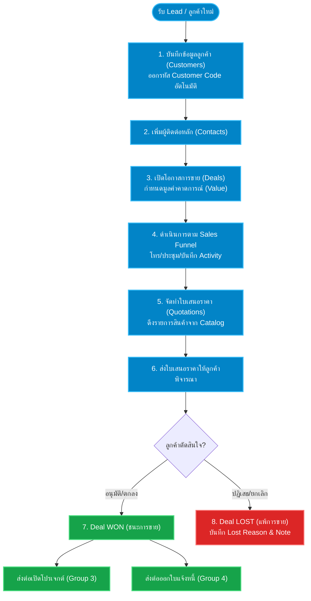

---

### 2.2 Diagram: Deal Stage & Funnel Lifecycle (State Machine)
วงจรสถานะของ Deal ในแต่ละช่วงการขาย

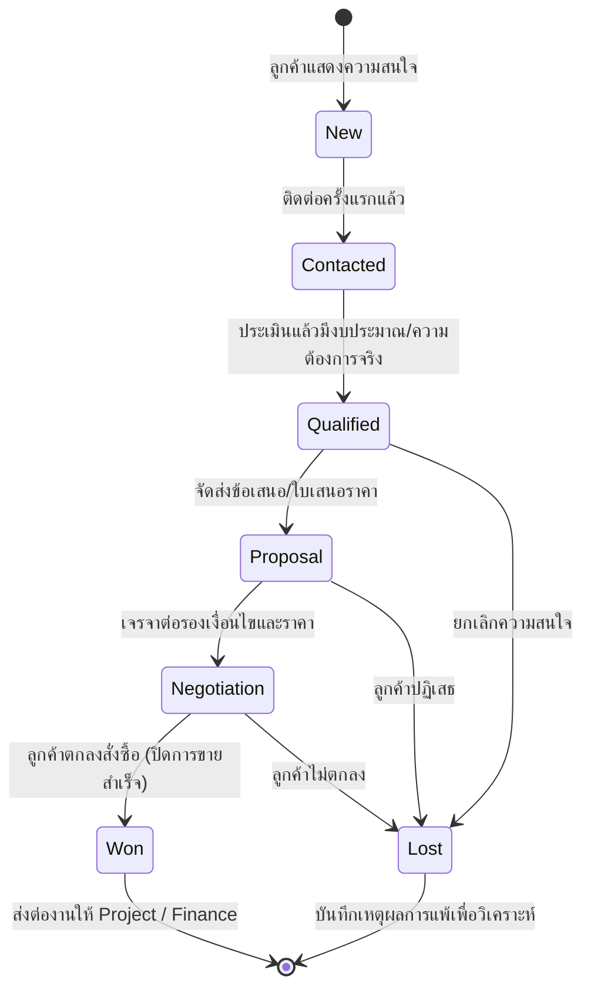

**คำอธิบายสถานะ Deal:**
- **New:** โอกาสการขายใหม่ ยังไม่ได้ติดต่อเชิงลึก
- **Contacted:** ได้พูดคุยเบื้องต้นทางโทรศัพท์/LINE/อีเมล
- **Qualified:** ประเมินแล้วว่าลูกค้ามีคุณสมบัติและงบประมาณตรงกับบริการ
- **Proposal:** ส่งข้อเสนอหรือใบเสนอราคาอย่างเป็นทางการ
- **Negotiation:** อยู่ระหว่างการปรับแก้ขอบเขตงานหรือราคา
- **Won (Terminal Success):** ปิดการขายสำเร็จ ล็อคมูลค่าและเตรียมส่งต่องาน
- **Lost (Terminal Closed):** ปิดไม่สำเร็จ ต้องระบุเหตุผล (เช่น แพ้ราคา, ลูกค้ายกเลิกโครงการ)

---

### 2.3 Diagram: Quotation Issuance & Conversion Sequence
ลำดับการออกใบเสนอราคาและการแปลงเอกสาร

```mermaid
sequenceDiagram
    autonumber
    actor Sales as ฝ่ายขาย (Sales)
    participant QC as Quotation Controller
    participant Catalog as Product/Service Catalog
    participant DB as MariaDB
    actor Customer as ลูกค้า (Customer)
    participant Next as Project / Invoice Module

    Sales->>QC: สร้างใบเสนอราคาใหม่ (เลือก Deal + Customer)
    QC->>Catalog: ดึงรายการสินค้า/บริการ และราคามาตรฐาน
    Catalog-->>QC: ข้อมูลราคาและหน่วยนับ
    Sales->>QC: ระบุส่วนลด, ภาษี, เงื่อนไขการชำระเงิน
    QC->>DB: บันทึก Quotation (สถานะ: Draft &rarr; Sent)
    QC-->>Customer: ส่งเอกสารใบเสนอราคา (PDF/Email)
    
    Customer->>Sales: ยืนยันสั่งซื้อ / เซ็นอนุมัติ
    Sales->>QC: อัปเดตสถานะเป็น "Approved / Accepted"
    QC->>DB: อัปเดต Deal เป็น Won
    QC->>Next: Trigger ระบบเพื่อสร้าง Project หรือ Invoice อัตโนมัติ
```

---

## Group 3: Project Delivery & Execution (โมดูล 09-11)
**โมดูลที่เกี่ยวข้อง:** `09-projects`, `10-tasks`, `11-milestones`

### 3.1 Diagram: Project Initiation & Delivery Workflow
กระบวนการดำเนินโครงการและส่งมอบงาน

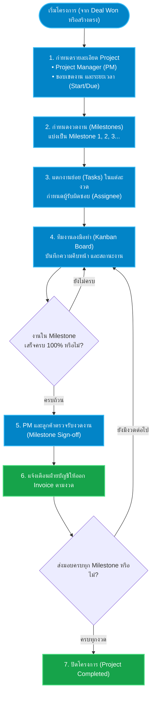

---

### 3.2 Diagram: Task Kanban Lifecycle & Blocker Handling (State Machine)
วงจรสถานะของงานย่อยและการจัดการปัญหาติดขัด

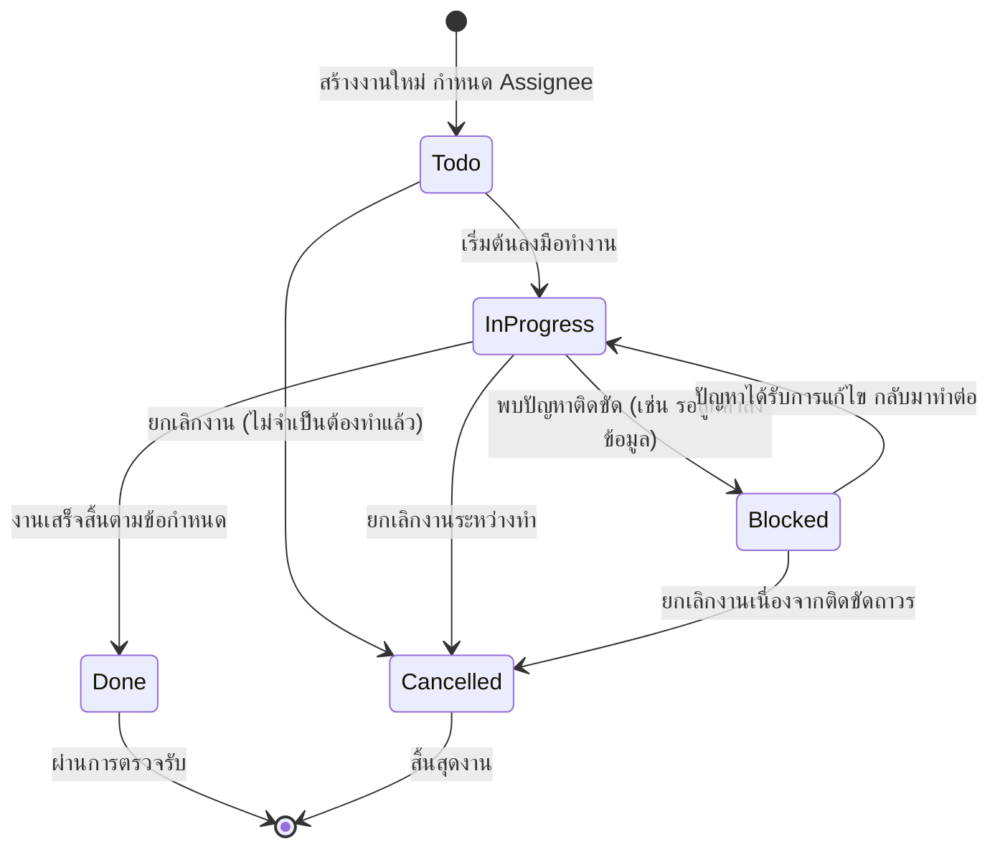

**คำอธิบายการจัดการงานติดขัด (Blocker Rules):**
- เมื่องานถูกเปลี่ยนสถานะเป็น `Blocked` ระบบจะบังคับให้ใส่เหตุผลที่ติดขัด (`blocker_reason`)
- Dashboard และการแจ้งเตือนจะแจ้งเตือน PM ทันทีเพื่อเข้าช่วยเหลือแก้ไขปัญหาอย่างรวดเร็ว

---

### 3.3 Diagram: Milestone Verification & Billing Trigger Sequence
ลำดับการตรวจรับงวดงานและส่งสัญญาณออกบิล

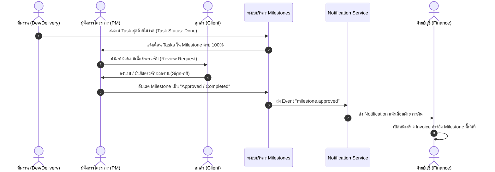

---

## Group 4: Finance, Billing & Cost Control (โมดูล 12-16)
**โมดูลที่เกี่ยวข้อง:** `12-products`, `13-suppliers`, `14-invoices`, `15-payments`, `16-expenses`

### 4.1 Diagram: Order-to-Cash & Expense Control Flow
ผังกระบวนการเงินทั้งขาเข้า (รับชำระ) และขาออก (ค่าใช้จ่าย)

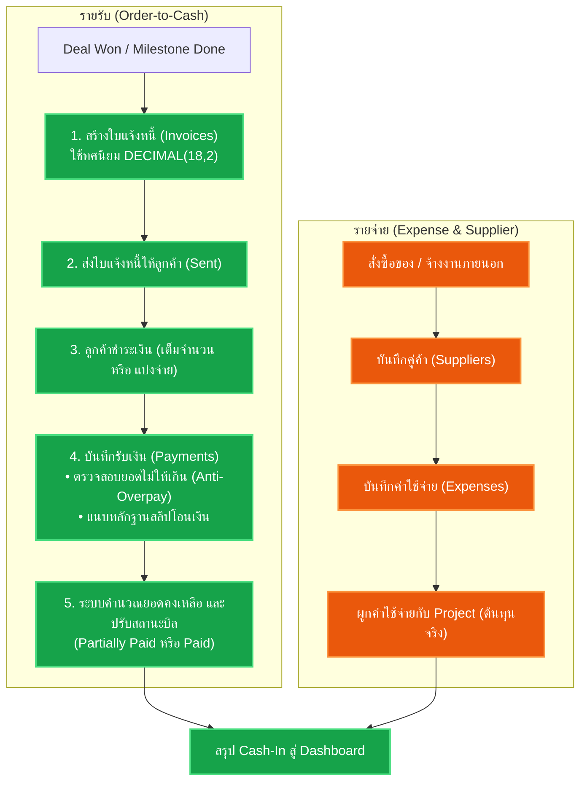

---

### 4.2 Diagram: Invoice Status Machine & Anti-Overpayment Settlement Sequence
วงจรสถานะใบแจ้งหนี้และการดักจับการชำระเงินเกิน

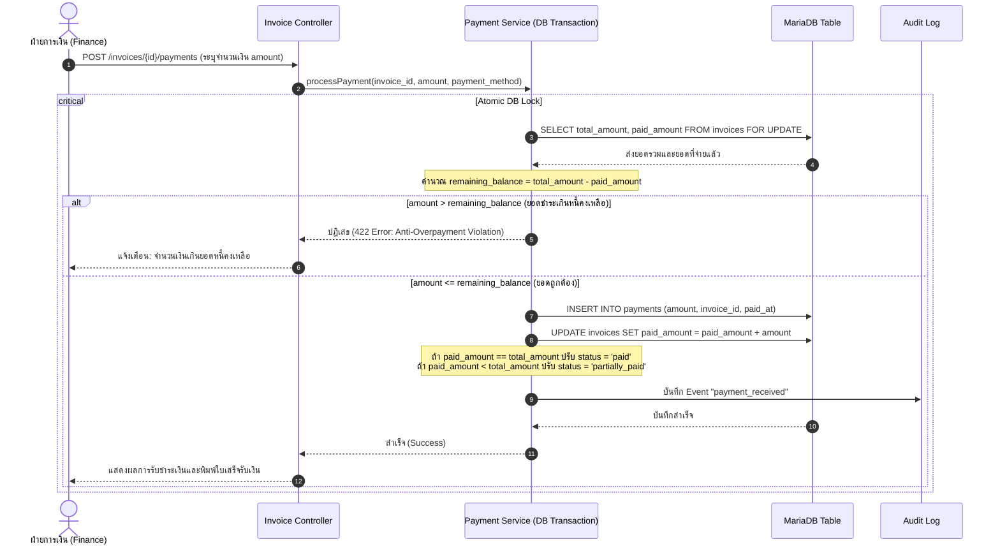

---

### 4.3 Diagram: Expense Recording & Project Cost Allocation Flow
การบันทึกค่าใช้จ่ายและการวิเคราะห์กำไรของโครงการ

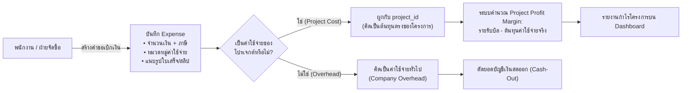

---

## Group 5: Insights, Platform & Automation (โมดูล 17-23)
**โมดูลที่เกี่ยวข้อง:** `17-dashboard`, `18-reports`, `19-files`, `20-notifications`, `21-automation`, `22-import-export`, `23-api`

### 5.1 Diagram: Event-Driven Platform & Automation Pipeline
โครงสร้างการกระจาย Event สู่การแจ้งเตือนและการทำงานอัตโนมัติ

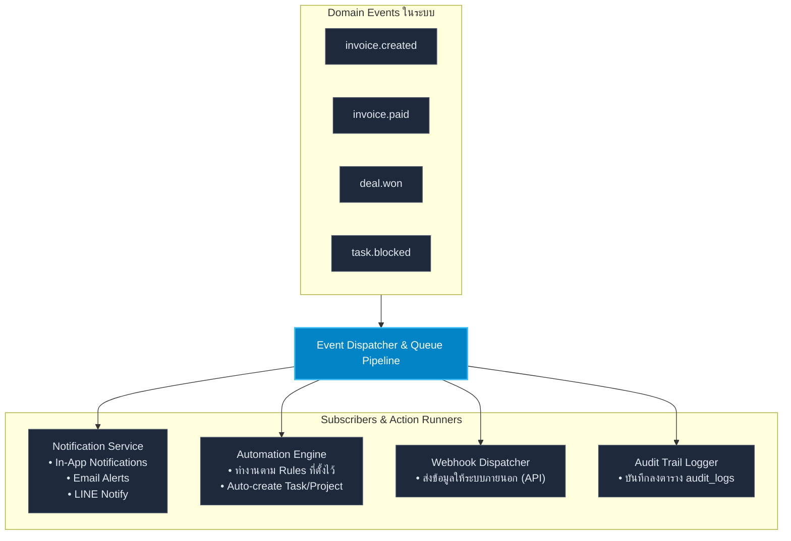

---

### 5.2 Diagram: Executive & Financial Dashboard Metric Lineage
ผังการรวบรวมข้อมูลดิบสู่ตัวชี้วัด KPI ของผู้บริหาร

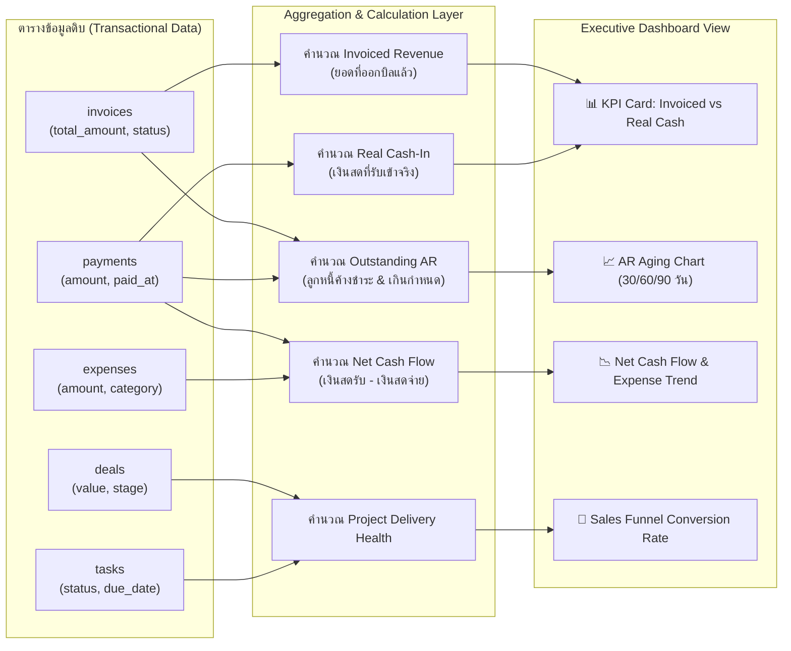

---

### 5.3 Diagram: File Attachment & Tenant Storage Security Flow
ลำดับการอัปโหลดไฟล์แนบและรักษาความปลอดภัยของไฟล์

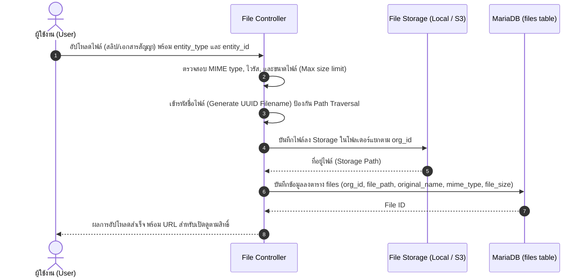

---

## Group 6: Operations & Advanced Extensions (Phase 7-18)
**โมดูลที่เกี่ยวข้อง:** `24-purchase-orders`, `25-inventory`, `26-employees`, `27-attendance-leave`, `28-payroll`, `29-ai-assistant`, `30-accounting-integration`, `31-customer-portal`

### 6.1 Diagram: Procurement & Inventory Movement Flow
กระบวนการจัดซื้อและการเคลื่อนไหวของสินค้าคงคลัง

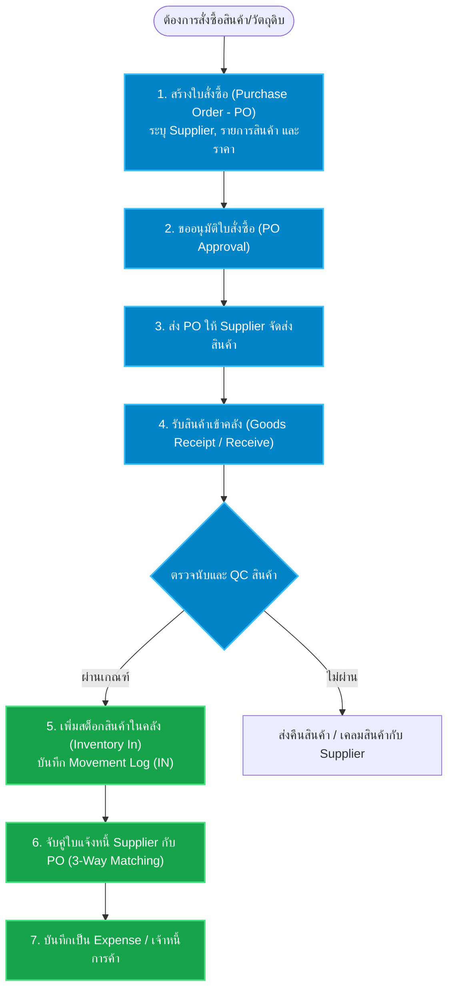

---

### 6.2 Diagram: Phase 16B Payroll, Policy & GL Flow
Phase 16B ใช้ `users` เป็น employee identity; attendance, leave และ OT ยังไม่อยู่ใน calculation scope

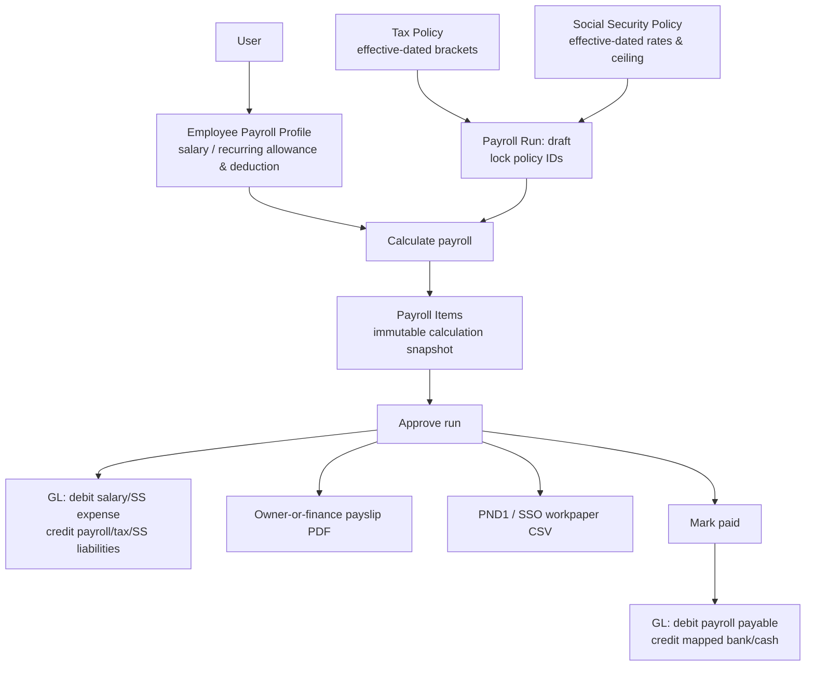

---

### 6.3 Diagram: External Accounting & Customer Portal Integration Grid
ผังการเชื่อมต่อระบบบัญชีภายนอกและการเปิดพอร์ทัลให้ลูกค้า

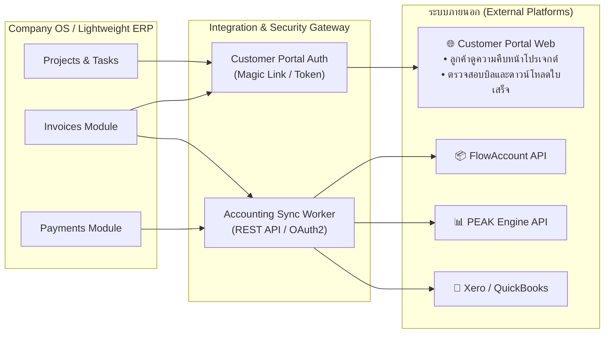

---

## 🎯 สรุปการนำไปใช้งาน (Usage & Navigation)

1. **สำหรับ Developers:** สามารถใช้อ้างอิง Entity State Transitions และ Service Workflow ในการเขียน Code และ Unit Tests
2. **สำหรับ Project Managers / Business Analysts:** ใช้ตรวจสอบความครบถ้วนของกระบวนการทำงานและเกณฑ์การตรวจรับงาน (Acceptance Criteria)
3. **สำหรับ Stakeholders / Executives:** ใช้ทำความเข้าใจภาพรวมการไหลของข้อมูลตั้งแต่ต้นน้ำ (Lead/Customer) จนถึงปลายน้ำ (Cash-In & Financial Statements)
