# Company OS / Lightweight ERP — System Diagrams & Architecture

เอกสารนี้รวบรวม **Diagram ทั้งหมดของระบบ** ครอบคลุมทั้งระดับสถาปัตยกรรม (Architecture), เวิร์กโฟลว์ธุรกิจ (Workflow), ลำดับการทำงาน (Sequence), การไหลของข้อมูล (Dataflow), และวงจรสถานะ (Lifecycle) โดยถูกสร้างขึ้นด้วย **Archify Showcase Standard** และบันทึกเป็น Interactive Standalone HTML พร้อม JSON Spec

🌐 **หน้าเมนูรวมไดอะแกรมทั้งหมด:** เปิดไฟล์ [`document/index.html`](./index.html) ในเบราว์เซอร์

---

## 📑 สารบัญไดอะแกรมทั้งหมด (Table of Diagrams)

| # | ชื่อไดอะแกรม | ประเภท | ไฟล์ Interactive HTML | ไฟล์ JSON Spec |
|---|---|---|---|---|
| **01** | [System & Tech Stack Architecture](#01-system--tech-stack-architecture) | Architecture | [`01_system_architecture.html`](./01_system_architecture.html) | [`specs/01_system_architecture.json`](./specs/01_system_architecture.json) |
| **02** | [Multi-Tenancy & Org Hierarchy](#02-multi-tenancy--org-hierarchy) | Architecture | [`02_multitenancy_org_hierarchy.html`](./02_multitenancy_org_hierarchy.html) | [`specs/02_multitenancy_org_hierarchy.json`](./specs/02_multitenancy_org_hierarchy.json) |
| **03** | [Core Business Workflow](#03-core-business-workflow) | Workflow | [`03_business_core_workflow.html`](./03_business_core_workflow.html) | [`specs/03_business_core_workflow.json`](./specs/03_business_core_workflow.json) |
| **04** | [Auth, Session & RBAC Flow](#04-auth-session--rbac-flow) | Sequence | [`04_auth_session_rbac_sequence.html`](./04_auth_session_rbac_sequence.html) | [`specs/04_auth_session_rbac_sequence.json`](./specs/04_auth_session_rbac_sequence.json) |
| **05** | [Invoice Creation & Payment Settlement](#05-invoice-creation--payment-settlement) | Sequence | [`05_invoice_creation_payment_sequence.html`](./05_invoice_creation_payment_sequence.html) | [`specs/05_invoice_creation_payment_sequence.json`](./specs/05_invoice_creation_payment_sequence.json) |
| **06** | [ERP Data Lineage & Pipeline](#06-erp-data-lineage--pipeline) | Dataflow | [`06_erp_data_lineage_flow.html`](./06_erp_data_lineage_flow.html) | [`specs/06_erp_data_lineage_flow.json`](./specs/06_erp_data_lineage_flow.json) |
| **07** | [Sales Opportunity & Deal Lifecycle](#07-sales-opportunity--deal-lifecycle) | Lifecycle | [`07_deal_sales_lifecycle.html`](./07_deal_sales_lifecycle.html) | [`specs/07_deal_sales_lifecycle.json`](./specs/07_deal_sales_lifecycle.json) |
| **08** | [Invoice Status & Payment Lifecycle](#08-invoice-status--payment-lifecycle) | Lifecycle | [`08_invoice_lifecycle.html`](./08_invoice_lifecycle.html) | [`specs/08_invoice_lifecycle.json`](./specs/08_invoice_lifecycle.json) |
| **09** | [Task Status Lifecycle](#09-task-status-lifecycle) | Lifecycle | [`09_task_project_lifecycle.html`](./09_task_project_lifecycle.html) | [`specs/09_task_project_lifecycle.json`](./specs/09_task_project_lifecycle.json) |
| **10** | [Database ER & Domain Model](#10-database-er--domain-model) | Architecture | [`10_database_er_domain_model.html`](./10_database_er_domain_model.html) | [`specs/10_database_er_domain_model.json`](./specs/10_database_er_domain_model.json) |
| **11** | [Payroll Policy, Approval & GL Flow](#11-payroll-policy-approval--gl-flow) | Workflow | [`11_payroll_policy_gl_flow.html`](./11_payroll_policy_gl_flow.html) | [`specs/11_payroll_policy_gl_flow.json`](./specs/11_payroll_policy_gl_flow.json) |
| **12** | [Enterprise Document Lifecycle & Retention](#12-enterprise-document-lifecycle--retention-governance) | Lifecycle | [`12_document_management_lifecycle.html`](./12_document_management_lifecycle.html) | [`specs/12_document_management_lifecycle.json`](./specs/12_document_management_lifecycle.json) |
| **13** | [Two-Factor Authentication & Privileged Access Flow](#13-two-factor-authentication--privileged-access-flow) | Sequence | [`13_two_factor_auth_sequence.html`](./13_two_factor_auth_sequence.html) | [`specs/13_two_factor_auth_sequence.json`](./specs/13_two_factor_auth_sequence.json) |
| **All** | [Full Database ER Diagram (50+ Tables)](#14-full-database-er-diagram-50-ตาราง) | Database ERD | [`document/DATABASE_ERD.md`](./DATABASE_ERD.md) | [Central Database Schema](../docs/database/DATABASE.md) |

---

## 🧩 ไดอะแกรมรายกลุ่มการทำงาน 6 กลุ่ม (31 Modules Workflow)

นอกจากภาพรวมสถาปัตยกรรมระดับระบบ 13 ชุดด้านบนแล้ว ยังมีเอกสารผังการทำงานเจาะลึกเฉพาะ **6 กลุ่มงานหลัก ครอบคลุม 31 โมดูลทั้งหมด** พร้อมคำอธิบายภาษาไทยและ Mermaid Diagrams รวม 19 ชุด:

📄 **ดูรายละเอียดฉบับเต็ม:** [`document/GROUPS_WORKFLOW.md`](./GROUPS_WORKFLOW.md)

| กลุ่มงาน (Domain Group) | โมดูลที่ครอบคลุม | หัวข้อไดอะแกรมหลัก |
|---|---|---|
| **Group 1: Foundation & Security** | `01-04` (Org, User/Role, Settings, Audit) | • Multi-Tenant Scope Flow • RBAC 7 Roles Policy Gate • Audit Trail Pipeline |
| **Group 2: CRM & Sales Pipeline** | `05-08` (Customers, Contacts, Deals, Quotations) | • Lead-to-Quote Workflow • Deal Stage State Machine • Quotation Issuance Sequence |
| **Group 3: Project Delivery & Execution** | `09-11` (Projects, Tasks, Milestones) | • Project Delivery Workflow • Task Kanban Lifecycle • Milestone Sign-off Trigger |
| **Group 4: Finance, Billing & Cost Control** | `12-16` (Products, Suppliers, Invoices, Payments, Expenses) | • Order-to-Cash & Expenses • Invoice Anti-Overpay Sequence • Project Cost Allocation |
| **Group 5: Insights, Platform & Automation** | `17-23` (Dashboard, Reports, Files, Notifications, Automation, API, Import/Export) | • Event & Automation Engine • Executive Metric Lineage • Tenant File Storage Flow |
| **Group 6: Operations & Advanced Extensions (Phase 7-18)** | `24-31` (PO, Inventory, Payroll, AI, Accounting, Portal) | • Procurement & Stock Movement • Payroll Policy, Payslip & GL • External Accounting & Portal Grid |

---

## รายละเอียดแต่ละไดอะแกรม (Diagram Details)

### 01. System & Tech Stack Architecture
- **ไฟล์ HTML:** [`01_system_architecture.html`](./01_system_architecture.html)
- **วัตถุประสงค์:** แสดง Full-Stack Monolith: React + Inertia + Vite + Tailwind CSS ทำงานกับ Laravel ผ่าน Inertia Protocol พร้อม database session, rate limiter, audit log และฐานข้อมูล MySQL/MariaDB
- **Mermaid Preview:**

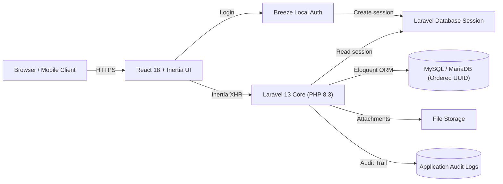

---

### 02. Multi-Tenancy & Org Hierarchy
- **ไฟล์ HTML:** [`02_multitenancy_org_hierarchy.html`](./02_multitenancy_org_hierarchy.html)
- **วัตถุประสงค์:** แสดงลำดับชั้นขององค์กรและการแบ่งสิทธิ์ (Tenant Isolation ผ่าน `org_id` และ 7 Built-in Roles: `owner`, `admin`, `sales`, `project_manager`, `finance`, `member`, `viewer`)
- **Mermaid Preview:**

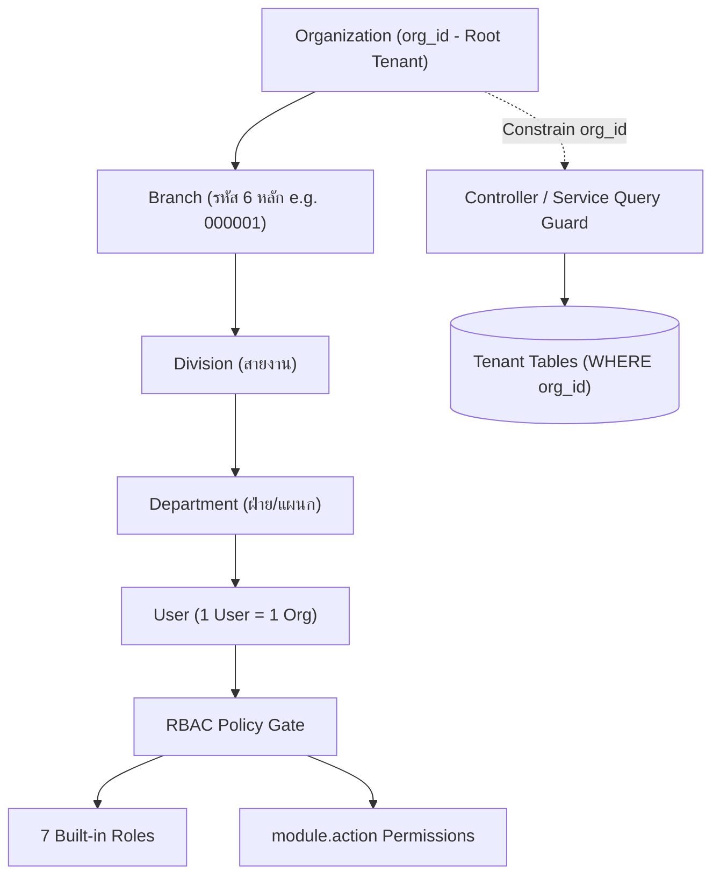

---

### 03. Core Business Workflow
- **ไฟล์ HTML:** [`03_business_core_workflow.html`](./03_business_core_workflow.html)
- **วัตถุประสงค์:** เวิร์กโฟลว์แกนธุรกิจหลัก ตั้งแต่รับลูกค้า &rarr; ดีลการขาย &rarr; ส่งมอบโปรเจกต์ &rarr; ออกใบแจ้งหนี้ &rarr; รับเงิน &rarr; รายงาน Dashboard
- **Mermaid Preview:**

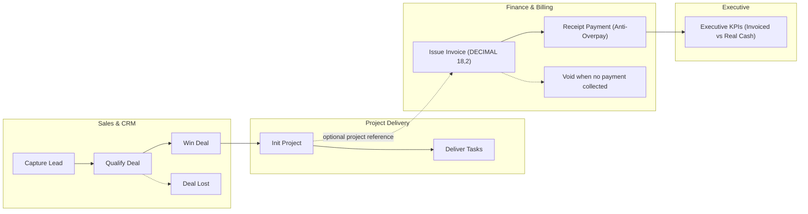

---

### 04. Auth, Session & RBAC Flow
- **ไฟล์ HTML:** [`04_auth_session_rbac_sequence.html`](./04_auth_session_rbac_sequence.html)
- **วัตถุประสงค์:** ลำดับการยืนยันตัวตน, Rate Limit ป้องกันการสุ่มรหัสผ่าน, การสร้าง Session ในฐานข้อมูล และการตรวจสิทธิ์ก่อนส่ง Inertia Props
- **Mermaid Preview:**

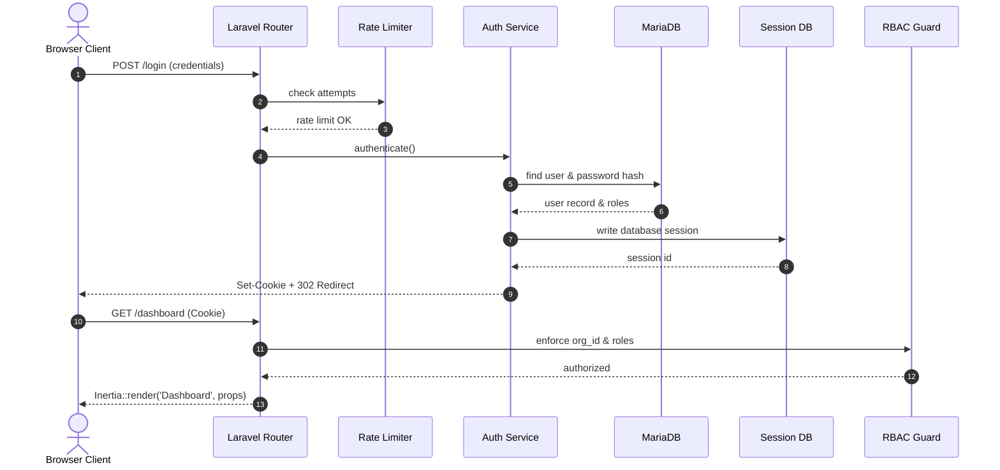

---

### 05. Invoice Creation & Payment Settlement
- **ไฟล์ HTML:** [`05_invoice_creation_payment_sequence.html`](./05_invoice_creation_payment_sequence.html)
- **วัตถุประสงค์:** ลำดับการออกบิล, การคำนวณเงินระดับ `DECIMAL(18,2)`, การบันทึกรับเงินพร้อม Anti-Overpayment Guard และ Audit Log
- **Mermaid Preview:**

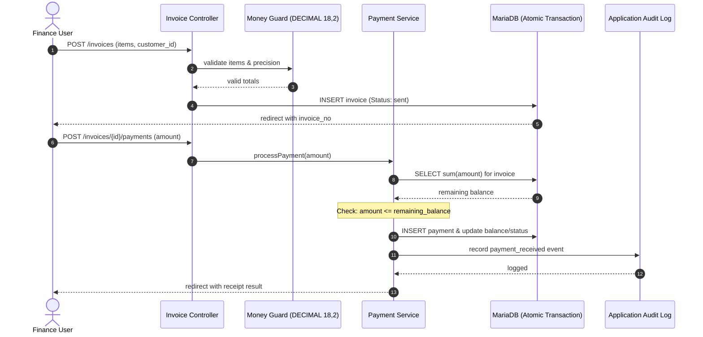

---

### 06. ERP Data Lineage & Pipeline
- **ไฟล์ HTML:** [`06_erp_data_lineage_flow.html`](./06_erp_data_lineage_flow.html)
- **วัตถุประสงค์:** แสดงการเดินทางของข้อมูลใน 5 ลำดับขั้น (Master Data &rarr; Sales Pipeline &rarr; Delivery &rarr; Transactions &rarr; Dashboards)
- **Mermaid Preview:**

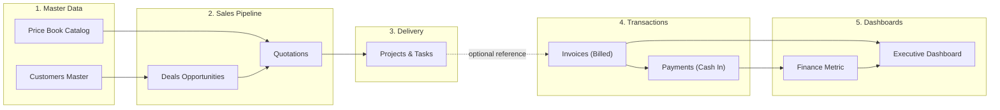

---

### 07. Sales Opportunity & Deal Lifecycle
- **ไฟล์ HTML:** [`07_deal_sales_lifecycle.html`](./07_deal_sales_lifecycle.html)
- **วัตถุประสงค์:** แสดงสถานะ Deal ที่ระบบรองรับ: `new`, `contacted`, `qualified`, `proposal`, `negotiation`, `won`, `lost`
- **Mermaid Preview:**

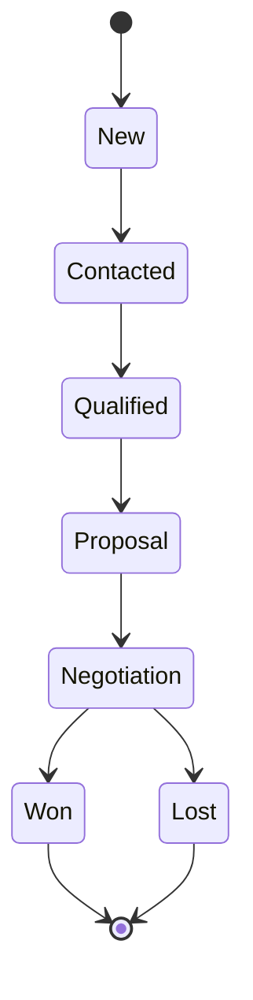

---

### 08. Invoice Status & Payment Lifecycle
- **ไฟล์ HTML:** [`08_invoice_lifecycle.html`](./08_invoice_lifecycle.html)
- **วัตถุประสงค์:** แสดงสถานะ Invoice ที่ระบบรองรับ: `draft`, `sent`, `partially_paid`, `paid`, `overdue`, `void`
- **Mermaid Preview:**

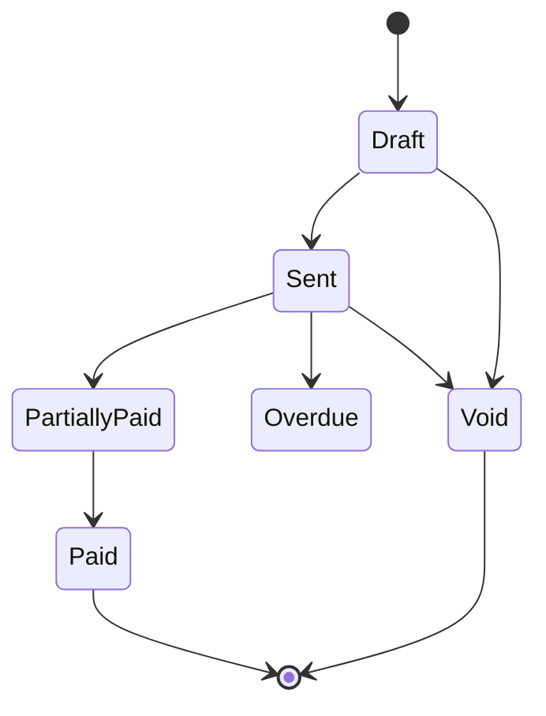

---

### 09. Task Status Lifecycle
- **ไฟล์ HTML:** [`09_task_project_lifecycle.html`](./09_task_project_lifecycle.html)
- **วัตถุประสงค์:** แสดงสถานะ Task ที่ระบบรองรับ: `todo`, `in_progress`, `blocked`, `done`, `cancelled`
- **Mermaid Preview:**

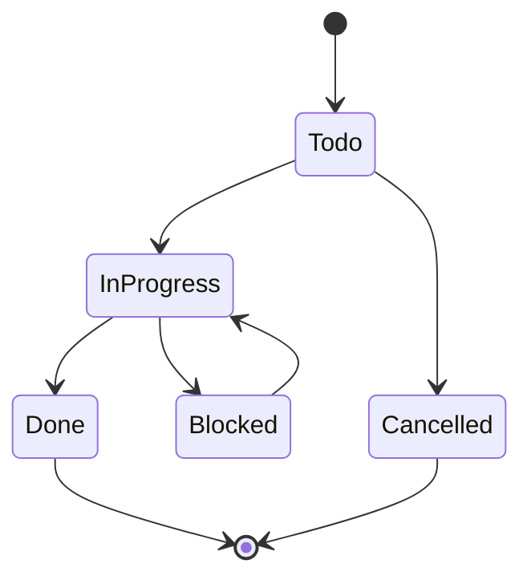

---

### 10. Database ER & Domain Model
- **ไฟล์ HTML:** [`10_database_er_domain_model.html`](./10_database_er_domain_model.html)
- **วัตถุประสงค์:** แสดงความสัมพันธ์ Entity หลักของ ERP: identity, CRM, project, finance, treasury และ general ledger โดยใช้ ordered UUID, `org_id` tenant scope และ decimal money fields
- **Mermaid Preview:**

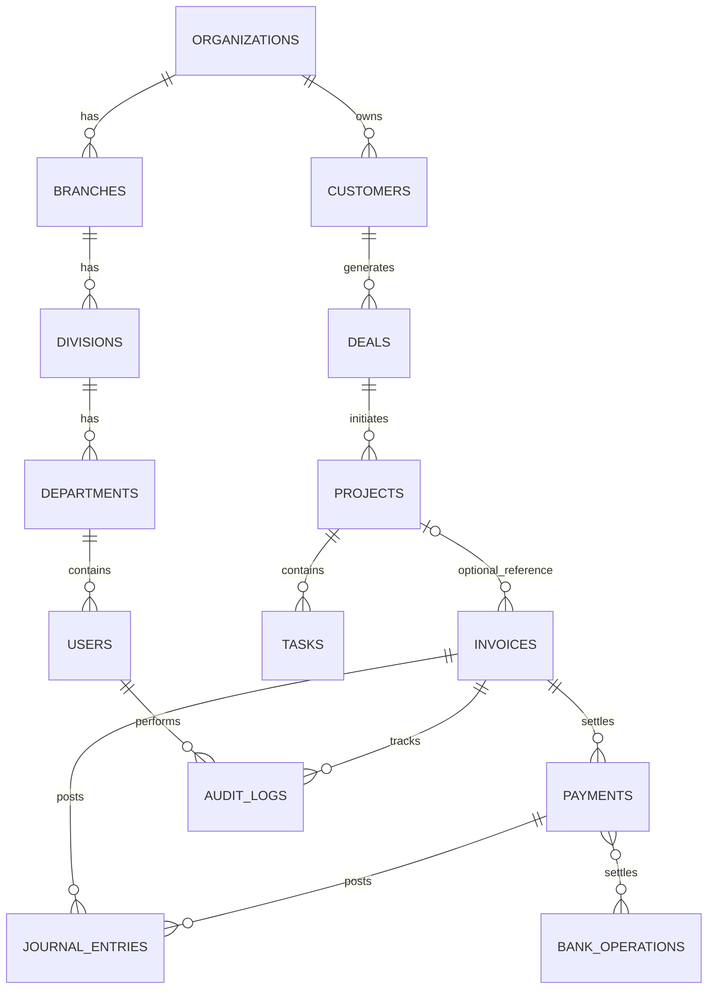

---

### 11. Payroll Policy, Approval & GL Flow
- **ไฟล์ HTML:** [`11_payroll_policy_gl_flow.html`](./11_payroll_policy_gl_flow.html)
- **วัตถุประสงค์:** แสดง Payroll Phase 16B ตามที่ใช้งานจริง: โปรไฟล์เงินเดือนและ policy แบบ effective-dated, การคำนวณ item snapshot, การอนุมัติ, การบันทึก GL แยก accrual/settlement และ output payslip/CSV
- **ขอบเขต:** ใช้ `users`, `employee_payroll_profiles`, `payroll_runs`, `payroll_items` โดย PND1/SSO CSV เป็น workpaper สำหรับตรวจทานก่อนยื่น

---

### 12. Enterprise Document Lifecycle & Retention Governance
- **ไฟล์ HTML:** [`12_document_management_lifecycle.html`](./12_document_management_lifecycle.html)
- **วัตถุประสงค์:** แสดงวงจรชีวิตเอกสารองค์กร (Phase 17 DMS): การอัปโหลดไฟล์เก็บ private storage แยก tenant, ตรวจสอบความปลอดภัยด้วย SHA256 checksum และ AV scan, สถานะ Active พร้อมผูกความสัมพันธ์กับ Invoices/Expenses/Assets/Contracts/Employees, การแจ้งเตือนใกล้หมดอายุ (Expiring), การทบทวน Retention Policy และ Legal Hold, จนถึงการจัดเก็บถาวร (Archive) หรือทำลายตามนโยบาย (Purged)
- **Mermaid Preview:**

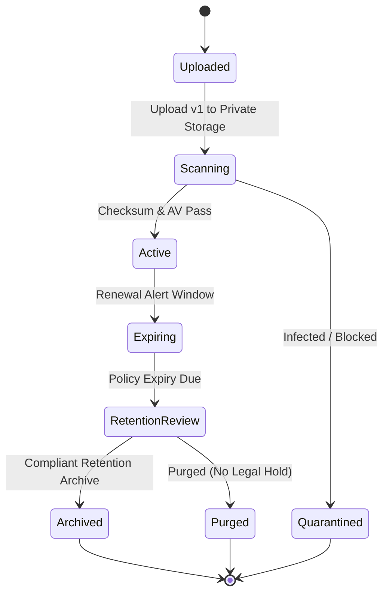

---

### 13. Two-Factor Authentication & Privileged Access Flow
- **ไฟล์ HTML:** [`13_two_factor_auth_sequence.html`](./13_two_factor_auth_sequence.html)
- **วัตถุประสงค์:** แสดงกระบวนการยืนยันตัวตนสองขั้นตอน (Phase 18 2FA/TOTP): การตรวจสอบรหัสผ่าน, ประเมินนโยบายความปลอดภัยระดับองค์กร (บังคับใช้กับ Owner, Admin, Finance), การส่งคำขอ OTP (RFC 6238) หรือรหัสกู้คืนฉุกเฉิน (Recovery Codes), การออกโทเค็น Trusted Device 30 วัน, และการบังคับผ่าน `EnsureTwoFactorEnrollment` Middleware
- **Mermaid Preview:**

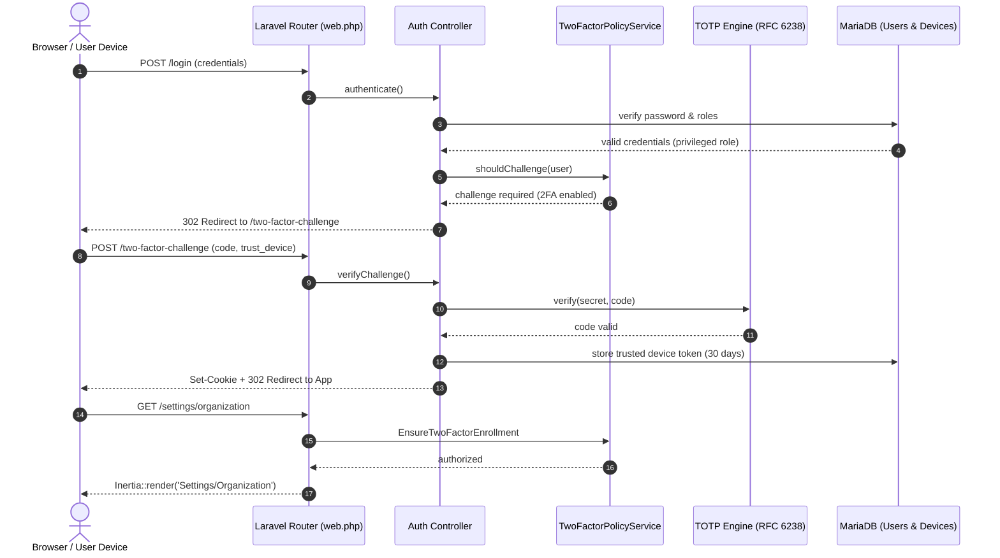

---

### 14. Full Database ER Diagram (50+ Tables)
- **ไฟล์เอกสาร:** [`DATABASE_ERD.md`](./DATABASE_ERD.md)
- **วัตถุประสงค์:** ผังโครงสร้างฐานข้อมูลฉบับสมบูรณ์ทั้ง 50+ ตาราง ครอบคลุม 12 โดเมน พร้อม Data Types, Primary Keys (UUIDv7), Foreign Keys, และกฎ Multi-Tenancy Scoping (`org_id`)
- **Mermaid Preview (Master Cross-Domain):**

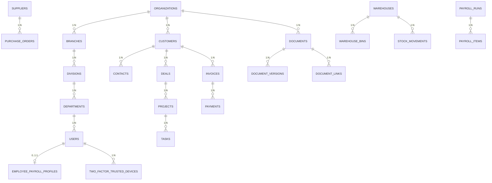

---

### 15. 6 Domain Group Workflows (31 Modules)
- **ไฟล์เอกสาร:** [`GROUPS_WORKFLOW.md`](./GROUPS_WORKFLOW.md)
- **วัตถุประสงค์:** ผังกระบวนการทำงานและวงจรสถานะเจาะลึก 6 กลุ่มงานหลัก ครอบคลุมทั้ง 31 โมดูล (รวม 19 Mermaid Diagrams พร้อมคำอธิบายภาษาไทย)
- **Mermaid Preview (Inter-Group Interaction):**

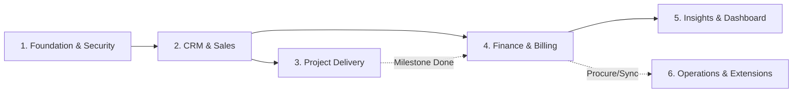

---

## 🛠️ วิธีการเปิดดูและใช้งาน

1. **เปิดผ่านเบราว์เซอร์:**
   - ดับเบิลคลิกไฟล์ [`document/index.html`](./index.html) หรือไฟล์ `.html` ใดๆ เพื่อเปิด interactive viewer ในเบราว์เซอร์
   - สามารถกดปุ่มสลับ **Light / Dark mode**, **Focus View**, **Pan & Zoom**, และ **Export เป็น SVG / PNG / WebP** ได้ทันที
2. **เปิดดูเอกสารผังรายกลุ่มและ ERD:**
   - ผังการทำงาน 6 กลุ่มโมดูล (31 Modules): [`document/GROUPS_WORKFLOW.md`](./GROUPS_WORKFLOW.md)
   - ผังฐานข้อมูล 38+ ตาราง: [`document/DATABASE_ERD.md`](./DATABASE_ERD.md)
3. **แก้ไขหรือสร้างใหม่:**
   - ไฟล์ JSON Specification อยู่ในโฟลเดอร์ [`document/specs/`](./specs/)
   - สามารถรันคำสั่ง `node <archify-path>/bin/archify.mjs deliver <type> <spec.json> <output.html> --quality showcase --json` เพื่อ render ใหม่ได้ตลอดเวลา
